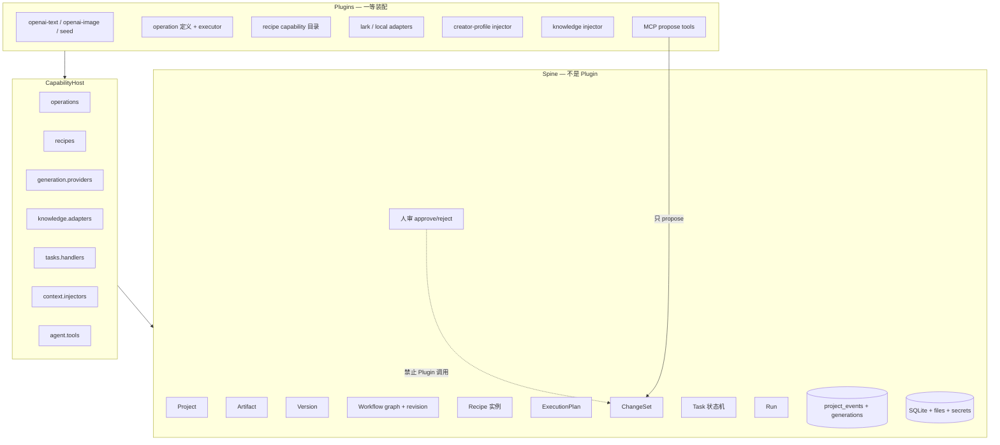
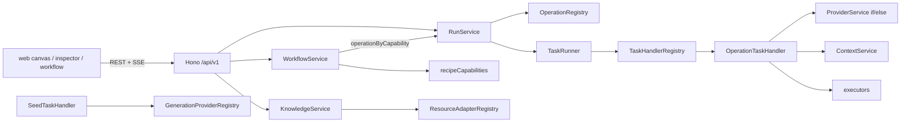
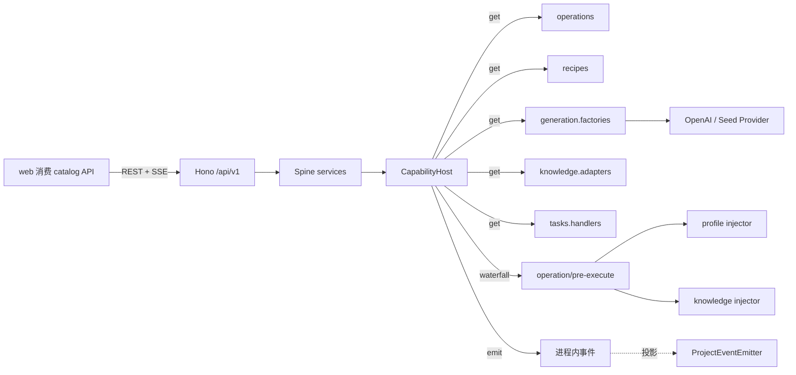
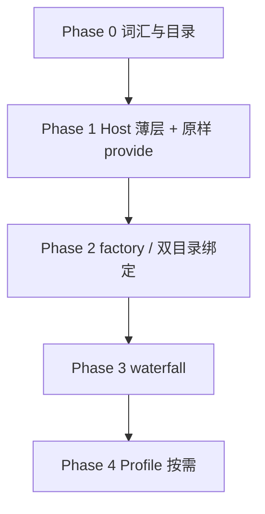
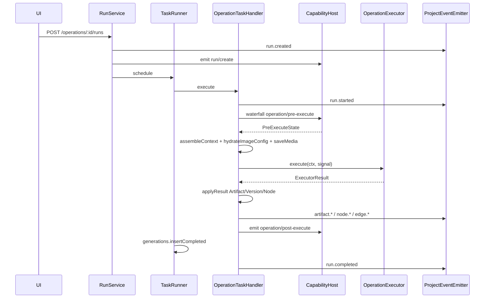
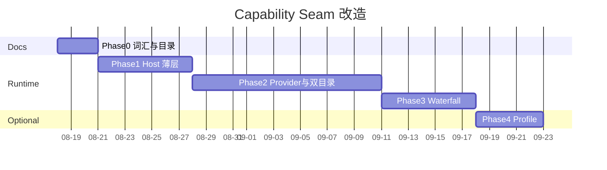

# Creator Studio — Capability Seam 架构草案与改造计划

| 字段 | 值 |
| --- | --- |
| 文档标题 | Capability Seam 架构草案 + 详细改造计划 |
| 作者 | Creator Studio（待评审） |
| 日期 | 2026-08-14 |
| 状态 | Draft |
| 建议入库位置 | `creator-studio/docs/architecture/capability-seams.md` |
| 适用代码基线 | `creator-studio/` Foundation + Creative Canvas V1 |
| 不引入的依赖 | Cordis、`@deepseek-ai/dsh-*`、任意第三方可执行插件 |

---

## Overview

Creator Studio 已经有创作域 Spine（Project / Canvas graph / Artifact / Version / Recipe 实例 / ChangeSet / 人审）和七处彼此独立的装配点（四套 Registry 类、一套 `ProviderService` 工厂、两张静态表）。它们各自能工作，但装配写死在 `apps/server/src/index.ts`，Provider 解析写死在 `ProviderService.resolve` 的 if/else，Operation 与 Recipe 用两份静态表加一处硬编码映射，上下文注入（Creator Profile、外部知识）塞在 `OperationTaskHandler.execute` 内部。加一个新 OpenAI 兼容模型要改 factory / 解析器；加一个新 recipe 还要改 `recipeCapabilityIdSchema` enum、`capabilities.ts` 和 `operationByCapability`。

本草案建议自研一薄层 **CapabilityHost**（进程内服务仓库 + emit / waterfall + LIFO dispose）。思想对照 Cordis 的 Definition / Provider / Consumer 与可逆注册；运行时不引入 `cordis` 包，也不实现 `ctx.effect`、热更新或用户路径 `import()`。Plugin 是仓库内的一等 TS 装配单元，不是产品的全部：Spine 永远不是 Plugin。Creative Canvas V1 的领域模型不变——Recipe 是可注册 capability 的项目内配置实例，Provider 是 seam provider，Run 是执行记录。前端消费 seam 目录的 HTTP 投影，不把 UI 做成 Plugin。

改造按 Phase 推进：先立词汇和目录，再把现有 Registry **原样 provide** 且对外行为不变，再收 Provider 解析与 Operation/Recipe 双目录（Registry 类保持 dumb，不反向依赖 kernel），再把文本/策略注入拆成 `PreExecuteState` waterfall。Profile / Bundle 只在多形态配置爆炸时再做。

---

## Background & Motivation

### 为什么现在要谈这件事

约束（本文沿用）：

1. **可以学思想，不要整仓搬 Cordis / DeepSeek Harness 当底座。** dsh 解决的是可替换的 agent runtime；Creator Studio 解决的是创作域产品（画布 / Artifact / Recipe / Run）。
2. 真正该借鉴：插件思想、Capability Seam 三角色、事件扩展点、可逆注册、Profile / Bundle 组装。
3. **不要把全部功能做成插件。** Project / Canvas graph / Artifact / Version / ChangeSet / 人审是 Spine。
4. 与 Creative Canvas V1 兼容：Recipe = 可注册 capability；Provider = seam provider；Run = 执行记录。
5. 推荐中间路线：自研一薄层 CapabilityHost。不引入 Cordis 包；不实现 `ctx.effect`、热更新、用户路径 `import()`。

`.feature/.feature-003-creative-canvas-v1/.prd` 的 non-goal 也已经写死：「Arbitrary third-party node code」「Fully autonomous agent execution」「Video or audio generation/editing」。本草案不得借「插件化」把这些 non-goal 偷渡进来。

`specs/000-system/spec.md` §3.3 / §3.4 在 Foundation 阶段已经把 Provider / Connector 写成 seam（capability Interface + Adapter）。今天的代码把这个思想实现成了**多套并列 Registry**，而不是一个可组合的 Host。

### 当前装配长什么样

`creator-studio/apps/server/src/index.ts` 是手写 `new` + `register` 的组线器。进程启动时一次性构造：

- `GenerationProviderRegistry([new SeedGenerationProvider()])` —— 只给 `SeedTaskHandler` 用
- `ProviderService(configs, secrets, fetchHttpClient)` —— Operation 真正走的解析器，内含 if/else
- `OperationRegistry(operationDefinitions)` —— 静态数组
- `ResourceAdapterRegistry([LocalResourceAdapter('obsidian'), LocalResourceAdapter('folder'), LarkResourceAdapter()])`
- `TaskHandlerRegistry().register(SeedTaskHandler).register(OperationTaskHandler).register(KnowledgeTaskHandler)`
- `recipeCapabilities` 不经 Registry，由 `workflow-routes.ts` 直接 `GET /workflow-capabilities` 吐出

测试各自复制这份装配：`providers/provider-integration.test.ts`、`operations/operation-runtime.test.ts`、`knowledge/knowledge.integration.test.ts`、`tasks/task-runtime.test.ts`。每加一个 seam 消费者，测试组线再抄一遍。

### 七处装配点（四套 Registry + 一套工厂 + 两张表）

下面七行不是七套 Registry。`ProviderService` 是工厂；`executors` / `operationCapability` / `recipeCapabilities` 是静态表。

| 名称 | 类别 | 路径 | 查找键 | 现状问题 |
| --- | --- | --- | --- | --- |
| `GenerationProviderRegistry` | Registry 类 | `apps/server/src/providers/generation-provider.ts` | `ProviderCapability`，`find` 第一个匹配 | 启动时只挂 Seed；与真实解析路径脱节 |
| `ProviderService` | 工厂，不是 Registry | `apps/server/src/providers/provider-service.ts` | workspace + capability | 带 `if (capability === 'image_generation')` / `if (capability !== 'text_generation')` |
| `OperationRegistry` | Registry 类 | `apps/server/src/operations/registry.ts` | `operationId`；另有 `getAvailableOperations` | 定义来自静态 `operationDefinitions` |
| `executors` + `operationCapability` | 静态表，不是 Registry | `apps/server/src/operations/executors.ts`、`definitions.ts` | executor 字符串、operationId | 与 Registry 平行的两张表 |
| `TaskHandlerRegistry` | Registry 类 | `apps/server/src/tasks/task-handler.ts` | `task.type`，最长前缀匹配 | `operation.generate_outline` → handler `operation`；`register` 返回 `this` |
| `ResourceAdapterRegistry` | Registry 类 | `apps/server/src/knowledge/resource-adapter.ts` | `ConnectionType` | 最接近完整 seam；只有构造期注入和 `require()`，无 `register`/`list`/`dispose` |
| `recipeCapabilities` | 静态表，不是 Registry | `apps/server/src/workflow/capabilities.ts` | `RecipeCapabilityId` | 硬编码表；与 Operation 靠 `WorkflowService.executePlan` 里的 `operationByCapability` 映射 |

另有一套 **Foundation stub Connector** 与知识连接并存：`SettingsService` 读写 `connector_configs`（`lark_cli` / `obsidian`，`availability: 'stub_only'`），真实读写走 `ConnectionService` + `ResourceAdapter`。本草案不在 Phase 1–3 合并这两条线。

### 痛点（有代码依据）

1. **双 Provider 路径。** `SeedTaskHandler` 调 `GenerationProviderRegistry.require('text_generation')`；`OperationTaskHandler.selectProvider` 调 `ProviderService.resolve`。新模型只改一边会静默走错。
2. **能力分支写在解析器里。** `ProviderService.resolve` 用 capability 做 if/else，再在循环里 `new OpenAITextProvider` / `new OpenAIImageProvider`。加 audio 真实 provider 必须改这个函数。
3. **Operation 与 Recipe 双目录漂移。** `operationDefinitions` 有 20+ 条；`recipeCapabilities` 只有 7 条；映射写死在 `WorkflowService.executePlan`（`text.draft → generate_outline` 等）。`recipeCapabilityIdSchema` 是 Zod enum，加一个 **recipe** 要改 contracts、`capabilities.ts` 和映射表。加一个 OpenAI 兼容 **模型** 不碰这个 enum（它是 recipe id，不是 provider key）。另：`text.rewrite` 绑到 operation `rewrite`，但 `rewrite` 的 `executor` 仍是 `operation.not_implemented`，而 `executors.ts` 里已有未接线的 `operation.rewrite`（见 Phase 2 绑定表与 PR-6a）。
4. **策略进了 executor 外围。** `OperationTaskHandler.execute` 在调用 executor 之前同步做：选 provider、`resolveOperationStyle`、`resolveOperationKnowledge`、`assembleContext`、`hydrateImageConfig`。Creator Profile 与知识检索不是可插拔的 pre-execute，而是 handler 内部步骤。
5. **「模型可见即已记录」未闭环。** `TaskRunner` 会写 `generations` 行，但文本 executor 的 `requestSnapshot` 只有 `{ promptLength }`（见 `executors.ts` `createTextExecutor`）。模型实际看到的拼装 prompt 没有完整落库。
6. **可逆注册不存在。** 所有 Registry 是构造期一次性填入。集成测试各自手写更小的依赖树（并不是「无法只挂 seed」），但没有统一 dispose，进程 shutdown 只 `server.close` + `database.close`。

### DeepSeek Harness / Cordis 对照（只映射思想）

dsh 公开文档（https://deepseek.com/harness/en/ 、`deepseek-ai/deepseek-harness` packages README）的核心句是：Everything is a plugin；Plugin = Service；Context = 服务仓库（`ctx.tools` / `ctx.llm` / `ctx.sessions`）；`inject` 声明依赖；Typed Events（`emit` / `waterfall` / `parallel` / `serial`）；Registrations are reversible effects；Seam 三角色；Profile + Bundle + Patch 组装；「模型可见即已记录」；扩展走挂点，不改核心循环。

映射到 Creator Studio，**不是**「把画布做成 Cordis 插件」：

| dsh / Cordis | Creator Studio 对应 | 刻意不对应 |
| --- | --- | --- |
| Plugin | 一等装配单元：一段 `apply(host)` 的一等 TS 模块 | 第三方任意 `.js`、热更新、模型自写插件 |
| Context / Service 仓库 | `CapabilityHost` 上的 typed service map | 不引入 `cordis` 包、不引入 `ctx.effect` API 表面 |
| Service Definition | seam 接口（`GenerationProvider`、`ResourceAdapter`、`TaskHandler`、`OperationExecutor`） | 不把 ProjectService 变成 Service Definition |
| Service Provider | `OpenAITextProvider`、`LarkResourceAdapter`、某个 recipe 定义 | Provider 配置行（`provider_configs`）仍是数据，不是 Plugin |
| Consumer | `OperationTaskHandler`、`KnowledgeService`、`WorkflowService`、前端 catalog API | 前端 React 组件不是 Consumer Plugin |
| `inject` | Host 上 `host.get('operations')`，缺依赖在 apply 期失败 | 不实现 Cordis 式延迟 inject 图算法 |
| `emit` | 进程内广播；与现有 `ProjectEventEmitter` 分层 | 不替代 SSE / `project_events` |
| `waterfall` | `operation/pre-execute` 策略链 | 不把 Artifact 写入做成 waterfall |
| Profile + Bundle | 概念先立住：`local-creator` / `demo` / `mcp-agent` | Phase 4 之前不上 yaml 引擎 |
| 「可见即记录」 | Run + `generations` + Version + `ProjectEvent` 不变量 | 不引入 dsh 的 conversation/session 模型 |
| 核心循环不可改 | `TaskRunner.drain` + `OperationTaskHandler.applyResult` + `WorkflowService` 人审 | 不把 Task 状态机、ChangeSet 审批做成 Plugin |

dsh 解决「换一套 agent loop / 换一套 tool 政策而不改 harness」。Creator Studio 要解决「换一个模型、加一个 recipe、插一段上下文策略，而不改画布、Artifact 和人审」。两者都需要 seam，但 Spine 不同。

---

## Goals & Non-Goals

### Goals

- 给出 Spine / Seam / Plugin 的可执行边界，并按此边界收拢现有装配点。
- 落地一个进程内 CapabilityHost：typed provide / get、emit、waterfall、LIFO dispose。
- 现有 HTTP、SSE、SQLite schema、Creative Canvas V1 领域模型对外行为不变。
- 新增一个 **image 模型**：加一等 TS factory 模块 + 在 bundle 列表里多一行 `apply`。新增一个 **recipe**：默认仍改 `recipeCapabilityIdSchema` enum（V1 钉死 7 个 id）；第 8 个能力再开独立 PR 放宽 enum，并在 `createRecipe` / graph command / execution plan 处 `require` Host catalog。不改 Node 组件。
- 把 Creator Profile / 知识注入 / demo 标记从 executor 外围拆到 `operation/pre-execute` waterfall（值类型是 `PreExecuteState`，不是裸 `ExecutorContext`）。
- 把「可见即记录」写成可测不变量，并补齐当前 prompt 只记长度的缺口。失败 generation 行维持现状（成功才写），不在 Phase 3 改。
- 给出按周可执行的 Phase 计划、回滚策略和独立可 merge 的 PR 切分。

### Non-Goals

- 不引入 Cordis 或 `@deepseek-ai/dsh-*` 作为运行时依赖。
- 不把 Project / Artifact / Version / Canvas graph / Recipe **实例** / ChangeSet / 人审做成 Plugin。
- 不做任意第三方 Node 代码加载、不做热更新、不做模型自写自挂插件。
- 不做 video / audio 新创作 UI（V1 non-goal）；seam 只预留 `audio_generation` / `video_generation` 能力位（`generation-provider.ts` 已有类型）。
- 不做多租户、集群、远程插件市场。
- 不把前端做成 Cordis 式插件运行时；不把 `shared/ui` 换成插件组件协议。
- 不在 Phase 1–3 引入 yaml Profile 引擎，不发明与现有领域模型冲突的新持久化实体。
- 不合并 `SettingsService` stub Connector 与 `ConnectionService` 真连接（另立项）。
- 不把 SQLite / file store / SecretStore 做成可替换 storage seam（见下文论证）。

---

## 词汇表

全文统一，不再引入「引擎 / 中间件 / 扩展点 / hook」等近义新词，除非指代已有符号。

| 术语 | 含义 |
| --- | --- |
| **Spine** | 创作域不可替换内核。改它等于改产品，不是改装配。 |
| **Seam** | 一处有 Definition / Provider / Consumer 三角色的可替换切口。 |
| **Plugin** | 仓库内一等 TS 模块，对 Host `apply`，返回 dispose。不是第三方包。 |
| **CapabilityHost** | 进程内薄层：服务仓库 + 事件 + 可逆注册。不是 Cordis；无 `ctx.effect`。 |
| **Definition** | seam 的接口与标识（例如 `GenerationProvider`、`ResourceAdapter`、`RecipeCapability`）。 |
| **Provider** | Definition 的具体实现（例如 `OpenAIImageProvider`、`LarkResourceAdapter`）。 |
| **Consumer** | 只依赖 Definition 的调用方（例如 `OperationTaskHandler`、`KnowledgeService`）。 |
| **Profile** | 一组 Bundle 的有序叠加，描述「这台进程以何种形态启动」。概念先立住。 |
| **Bundle** | 一组 Plugin + 配置补丁。概念先立住。 |
| **Recipe** | 项目内、带 `capabilityId` 与用户配置的**实例**（`recipes` 表）。它是 Spine 数据，不是 Plugin。 |
| **RecipeCapability** | Recipe 可选用的能力目录项。它是 seam 上的 Definition。 |
| **Operation** | 一次可执行能力的定义（`OperationDefinition`）+ executor。Run 的执行入口。 |
| **Run** | 一次 Operation 执行记录，不是画布节点。 |
| **ChangeSet** | 图命令提案；必须人审。MCP / agent 只能 propose。 |

---

## Spine vs Seam vs Plugin

### 判定规则

```text
改了会改变「什么是一首作品 / 谁有权改图 / 历史能不能回溯」→ Spine
改了只是「换一个模型、换一个资料源、换一段注入策略」→ Seam（接口）+ Plugin（实现）
现在只有一份实现、但调用方已按接口写 → 模块保持原位，接口按 Seam 写，暂不拆 Plugin
```

### Spine（永远不是 Plugin）

| 模块 | 路径 | 理由 |
| --- | --- | --- |
| Workspace / 本地身份 | `bootstrap/identity.ts`、`bootstrap/bootstrap-service.ts` | 单机身份，不是可替换能力 |
| Project | `projects/project-service.ts` | 创作任务聚合根 |
| Artifact + Version | `artifacts/`、`versions/` | 内容与不可变历史 |
| Canvas / Workflow graph | `canvas/`、`workflow/workflow-service.ts` 的图命令、revision、环检测 | 作品结构；`.spec` 写明 revisioned |
| Recipe **实例** | `recipes` 表、`WorkflowService.createRecipe` | 用户配置的工具节点，不是能力目录 |
| ExecutionPlan | `execution_plans` 表 | 一次不可变执行意图快照 |
| ChangeSet + 人审 | `change_sets` 表、`approveChangeSet` / `rejectChangeSet` | V1 安全边界：只有 UI 能批准 |
| Task 状态机 | `tasks/task-state-machine.ts`、`task-runner.ts` | 执行内核；扩展走 handler 注册，不换状态机 |
| Run 记录与幂等 | `operations/run-service.ts`、`run-repository.ts` | 执行账本 |
| Asset / File store | `assets/` | 二进制所有权 |
| SQLite schema / migration | `db/`、`migrations/` | 持久化内核 |
| HTTP envelope / 安全中间件 | `http/` | 协议内核 |
| `ProjectEvent` 持久化 + SSE | `events/` | 对外事件账本（进程内 Host 事件是另一层） |

### 必须是 Plugin（实现挂在 Seam 上）

| 实现 | 现有符号 | 所属 Seam |
| --- | --- | --- |
| Seed / OpenAI 文本 / OpenAI 图片 / 未来 audio video | `SeedGenerationProvider`、`OpenAITextProvider`、`OpenAIImageProvider`、`SeedMediaProvider` | `generation.providers` |
| Operation 定义 + executor | `operationDefinitions`、`executors` | `operations` |
| Recipe 能力目录项 | `recipeCapabilities` | `recipes` |
| Task handler 实现 | `SeedTaskHandler`、`OperationTaskHandler`、`KnowledgeTaskHandler` | `tasks.handlers` |
| 知识资源适配 | `LocalResourceAdapter`、`LarkResourceAdapter` | `knowledge.adapters` |
| 上下文注入策略 | `ContextService.resolveOperationStyle` / `resolveOperationKnowledge` | `context.injectors`（Phase 3 才拆） |
| MCP tool 声明 | `workflow-mcp-routes.ts` 的 `tools` 数组 | `agent.tools`（只 propose） |

### 暂时保持模块、接口按 Seam 写

| 模块 | 理由 |
| --- | --- |
| `ProviderService` | Phase 2 收成 factory 列表；Phase 1 只把它 `provide` 到 Host，不改 if/else |
| `ConnectionService` | 编排 adapter + 认证/安装；它是 Consumer，不是 Plugin |
| `KnowledgeService` | Consumer；adapter 才是 Plugin |
| `ContextService` + `assembleContext` | 拼装顺序以 `assembler.ts` 实现为准（见层序注）；注入源是 Seam |
| `SettingsService` | Foundation stub；与真连接并存，暂不 seam 化 |
| `SecretStore` | 安全内核，只被 Provider Plugin 使用 |
| `CreatorProfileService` | 画像 CRUD 是 Spine；注入是 Seam |

### 明确不做 storage / persistence seam

SQLite + `AssetFileStore` + `SecretStore` 是单机产品的物理底座，不是可替换能力。dsh 把 storage 做成插件是因为它要在多种 agent 部署里换后端。Creator Studio 只有一个本机数据目录（`CREATOR_STUDIO_DATA_DIR`，默认 `creator-studio/data/`）。做成 seam 会暗示「可以换 Postgres / S3」，与当前约束相反，还会把 `revision` 乐观并发和 migration 纪律冲掉。若未来真有第二持久化后端，再单独立项。

### 一张边界图



---

## Proposed Design

### 现有运行时（改造前）



两处断裂：`GenerationProviderRegistry` 与 `ProviderService` 并行；`recipeCapabilities` 与 `operationDefinitions` 靠硬编码映射。

### 目标运行时（改造后）



`index.ts` 从「手写 new」变成「构造 Spine 依赖 → `host.apply(foundationBundle)` → 取出服务挂路由」。

### CapabilityHost 放哪

**选定：`creator-studio/apps/server/src/kernel/`。**

理由：

- 当前共享包只有 `packages/contracts`。Host 不进浏览器，不必进 contracts。
- pnpm workspace 虽已包含 `creator-studio/packages/*`，但为 Phase 1 新建 `@creator-studio/kernel` 会引入包构建、export map、以及 server/web 对它的依赖边，收益只是「以后可能被第二个进程 import」。
- Host 单测放在 `apps/server/src/kernel/`，不必改 vitest 过滤。`test:foundation` 本身还跑 `packages/contracts`、`apps/web` 和 `e2e/`，不能说「现有测试全在 apps/server」。
- 若未来出现独立 MCP 进程或 worker 进程，再抽 `packages/kernel`。抽取成本是搬 4–6 个文件，低于现在先建空包。

不选 `packages/kernel` 的时机：只有 Host 被第二个 package 引用时。

### CapabilityHost 接口草案

```ts
// creator-studio/apps/server/src/kernel/types.ts

export type Dispose = () => void | Promise<void>

export interface Plugin {
  readonly name: string
  apply(host: CapabilityHost): Dispose | void | Promise<Dispose | void>
}

export interface Registry<T> {
  register(id: string, value: T): Dispose
  get(id: string): T | undefined
  require(id: string): T
  list(): ReadonlyArray<{ id: string; value: T }>
}

export interface CapabilityHost {
  provide<K extends keyof HostServices>(key: K, value: HostServices[K]): Dispose
  get<K extends keyof HostServices>(key: K): HostServices[K] | undefined
  require<K extends keyof HostServices>(key: K): HostServices[K]
  registry<K extends keyof HostRegistries>(key: K): Registry<HostRegistries[K]>

  on<E extends keyof HostEvents>(event: E, listener: (payload: HostEvents[E]) => void): Dispose
  emit<E extends keyof HostEvents>(event: E, payload: HostEvents[E]): void

  useWaterfall<E extends keyof HostWaterfalls>(
    event: E,
    listener: (value: HostWaterfalls[E], signal: AbortSignal) => HostWaterfalls[E] | Promise<HostWaterfalls[E]>,
  ): Dispose
  waterfall<E extends keyof HostWaterfalls>(
    event: E,
    value: HostWaterfalls[E],
    signal?: AbortSignal,
  ): Promise<HostWaterfalls[E]>

  apply(plugin: Plugin): Promise<Dispose>
  dispose(): Promise<void>
}
```

实现约束（`kernel/host.ts`）：

- `provide` 同 key 第二次调用抛错，除非先 dispose。避免「静默覆盖」。
- `registry.register` 同 id 第二次抛错（对齐 `TaskHandlerRegistry.register`）。
- `emit` 同步、隔离 listener 异常：单个 listener throw 记日志，不阻断其余 listener，也不回滚 Spine 写入。
- `waterfall` **按注册顺序**串行；listener throw → 整条链失败，调用方视为操作失败。
- `dispose` LIFO：后 apply 的先拆。`host.dispose()` 拆全部。
- 无动态 `import()` 用户路径，无 `vm`，无热更新。
- Host **不**持有 Database / Hono app。那些是 Spine，由 `index.ts` 注入给 Plugin 的闭包。

`catalog.ts` **只依赖 contracts 与本地接口文件**，禁止 import `OperationRegistry` / `ProviderService` / `ResourceAdapterRegistry` / `TaskHandlerRegistry` 实现类。条目类型来自 contracts 或与实现并列的 interface（`GenerationProvider`、`TaskHandler`、`OperationExecutor`、`ResourceAdapter`）。这样 `*Registry` 类永远不必 `import` kernel，循环依赖不会出现。

单源规则（Phase 1 起生效，Phase 2 严格执行）：

- **Host registry 持有条目，是唯一可变目录。**
- 现有 `*Registry` 保持 dumb 类：构造期吃一份数组 / Map，**类本身不 import kernel**。
- plugin `apply` 往 Host 注册；bundle 在全部 plugin apply 完后 `list()`，再 `new OperationRegistry(defs)` 这类快照交给 Consumer。
- 进程启动后不再往 dumb 类里追加（测试若要加条目：先 register，再重新 snapshot）。禁止「Registry 写一份、Host 再写一份」。
- **例外：`RecipeCatalog` 是 Host registry 的 live port**（闭包 `host.registry('recipes.capabilities'|'recipes.bindings')`）。`createRecipe` / graph `validate` / `executePlan` 在请求期 `require`，不能吃启动快照，否则测试「先 register 再 createRecipe」和运行中加第 8 个能力会对不上。`OperationCatalog` 与 `generation.factories` 仍是启动快照。

```ts
// creator-studio/apps/server/src/kernel/catalog.ts
// 只允许：@creator-studio/contracts、并列 interface（generation-provider / resource-adapter / task-handler / executors 的 type）
// 禁止：import { OperationRegistry } / ProviderService / *Registry 实现类

import type { OperationDefinition, RecipeCapability } from '@creator-studio/contracts'
import type { GenerationProvider, ProviderCapability } from '../providers/generation-provider.js'
import type { HttpJsonClient } from '../providers/openai-text-provider.js'
import type { ResourceAdapter } from '../knowledge/resource-adapter.js'
import type { TaskHandler } from '../tasks/task-handler.js'
import type { OperationExecutor } from '../operations/executors.js'

export interface GenerationProviderFactory {
  readonly key: string
  readonly capabilities: ReadonlySet<ProviderCapability>
  readonly priority: number
  match(input: {
    workspaceId: string
    capability: ProviderCapability
    configs: Array<{ providerKey: string; enabled: boolean; secretRef: string | null; configJson: string }>
  }): Promise<boolean>
  create(input: {
    workspaceId: string
    capability: ProviderCapability
    configs: Array<{ providerKey: string; enabled: boolean; secretRef: string | null; configJson: string }>
    secrets: { get(ref: string): Promise<string | undefined>; has(ref: string): Promise<boolean> }
    http: HttpJsonClient
  }): Promise<GenerationProvider>
}

export interface RecipeOperationBinding {
  recipeCapabilityId: string
  operationId: string
}

/** Phase 1 用结构 port 持有 dumb 快照，不引用实现类。 */
export interface OperationCatalog {
  getById(id: string): OperationDefinition | undefined
  require(id: string): OperationDefinition
  all(): OperationDefinition[]
  getAvailableOperations(context: {
    artifact: { kind: string; role: string }
    connectedInputs: Array<{ inputSlot: string }>
  }): OperationDefinition[]
}

export interface ProviderResolver {
  resolve(workspaceId: string, capability: ProviderCapability): Promise<GenerationProvider | undefined>
}

export interface AdapterCatalog {
  require(type: string): ResourceAdapter
}

export interface HandlerCatalog {
  get(type: string): TaskHandler | undefined
  require(type: string): TaskHandler
  register(handler: TaskHandler): HandlerCatalog
}

export interface RecipeCatalog {
  list(): readonly RecipeCapability[]
  require(id: string): RecipeCapability
  bindingFor(recipeCapabilityId: string): RecipeOperationBinding
}

/** 只发进程内 Host 事件。RunService / ProviderService 吃这个，不依赖 CapabilityHost。 */
export interface HostEmitter {
  emit<E extends keyof HostEvents>(event: E, payload: HostEvents[E]): void
}

export interface ProposeOnlyWorkflow {
  getSnapshot(identity: { workspaceId: string; creatorProfileId: string }, projectId: string): Promise<unknown>
  validate(projectId: string, expectedRevision: number, commands: unknown[]): unknown
  proposeChangeSet(identity: { workspaceId: string; creatorProfileId: string }, projectId: string, input: unknown): Promise<unknown>
  getChangeSet(identity: { workspaceId: string; creatorProfileId: string }, id: string): Promise<unknown>
}

export interface HostServices {
  'operations.catalog': OperationCatalog
  'providers.resolver': ProviderResolver
  'knowledge.adapters': AdapterCatalog
  'tasks.handlers': HandlerCatalog
}

export interface HostRegistries {
  'operations.definitions': OperationDefinition
  'operations.executors': OperationExecutor
  'operations.capability': ProviderCapability
  'recipes.capabilities': RecipeCapability
  'recipes.bindings': RecipeOperationBinding
  'generation.factories': GenerationProviderFactory
}

export interface HostEvents {
  'run/create': { workspaceId: string; projectId: string; runId: string; operationId: string }
  'provider/resolve': { workspaceId: string; capability: string; providerKey: string | null; fallback: boolean }
  'operation/post-execute': { runId: string; operationId: string; outputBehavior: string }
}

export interface PreExecuteState {
  workspaceId: string
  projectId: string
  runId: string
  operationId: string
  createdBy: string
  project: {
    title: string
    brief: string
    contentType?: string | null
    targetPlatform?: string | null
    /** 来自这一次 Run 的 ProjectRecord；injector 只读 state，禁止闭包装配期 Project。 */
    personalStyleId: string | null
  }
  sourceVersion?: import('@creator-studio/contracts').ArtifactVersion
  sourceKind?: string
  sourceRole?: string
  connectedInputs: import('@creator-studio/contracts').ArtifactVersion[]
  /** 用户/API 配置。禁止放入 hydrate 后的二进制。 */
  config: Record<string, unknown>
  personalStyleText?: string
  externalKnowledgeText?: string
  citations?: Array<{ sourceId: string; ref: string; sourceVersion: string | null; readAt: string }>
  layers?: Array<{ name: string; text: string }>
  provider?: GenerationProvider
  abort?: { reason: string }
}

export interface HostWaterfalls {
  'operation/pre-execute': PreExecuteState
}
```

Phase 1 只 `provide` 四个结构 port，值仍是今天的 dumb 实例（`OperationRegistry` 满足 `OperationCatalog`）。`HostRegistries` 在 Phase 2 启用。事件 / waterfall 在 Phase 3 启用。Consumer 不通过模块单例取 Host。

### 启动装配：`apply(host)` 但不强制拆包

```ts
// creator-studio/apps/server/src/kernel/foundation-bundle.ts

export function foundationBundle(deps: FoundationDeps): Plugin {
  return {
    name: 'bundle.foundation',
    apply(host) {
      const operations = new OperationRegistry(operationDefinitions)
      const adapters = new ResourceAdapterRegistry([
        new LocalResourceAdapter('obsidian'),
        new LocalResourceAdapter('folder'),
        new LarkResourceAdapter(),
      ])
      const providers = new ProviderService(deps.configs, deps.secrets, deps.http)
      const handlers = new TaskHandlerRegistry()
      // OperationTaskHandler / KnowledgeTaskHandler 仍由 index.ts 构造后 register
      host.provide('operations.catalog', operations)
      host.provide('providers.resolver', providers)
      host.provide('knowledge.adapters', adapters)
      host.provide('tasks.handlers', handlers)
      return () => { /* registries 无内部句柄，空 dispose */ }
    },
  }
}
```

`index.ts` 目标形态（Phase 1 结束）：

```ts
const host = createCapabilityHost()
await host.apply(foundationBundle({ configs, secrets, http: fetchHttpClient }))
const operationRegistry = host.require('operations.catalog')
const resourceAdapters = host.require('knowledge.adapters')
const providerService = host.require('providers.resolver')
const taskHandlers = host.require('tasks.handlers')
  .register(new SeedTaskHandler(new GenerationProviderRegistry([new SeedGenerationProvider()])))
  .register(operationTaskHandler)
  .register(new KnowledgeTaskHandler(connectionService, knowledgeService))

// shutdown
process.once('SIGINT', () => {
  void host.dispose().finally(() => { server.close(() => { database.close(); process.exitCode = 0 }) })
})
```

Phase 1 **允许** `SeedTaskHandler` 继续吃 `GenerationProviderRegistry`。双路径在 Phase 2 关掉。

### Consumer 如何拿到 Host：显式构造注入，禁止模块单例

不设 `getHost()`。`index.ts` 创建 Host，apply 完后取出 port，传入 Consumer 构造函数或 route 配置函数。测试各自 `createCapabilityHost()`。

目标签名（Phase 2 起；Phase 1 仍用今日签名，只是实例来自 bundle）：

```ts
// operations/registry.ts —— 保持 dumb，不 import kernel
class OperationRegistry {
  constructor(private readonly definitions: readonly OperationDefinition[]) {}
  // 保留：getById / require / all / getAvailableOperations
  // 不新增：不持有 Host，不提供 register/dispose
}

// knowledge/resource-adapter.ts —— 继续构造期快照
class ResourceAdapterRegistry {
  constructor(adapters: ResourceAdapter[]) {}
  require(type: ConnectionType): ResourceAdapter
  // Phase 2 不补 register + Dispose；若以后要动态加 adapter，另开 PR
}

// tasks/task-handler.ts —— 保留链式 register(this)，不改成 Host Dispose
class TaskHandlerRegistry {
  register(handler: TaskHandler): this
  get(type: string): TaskHandler | undefined
  require(type: string): TaskHandler
}

// providers/provider-service.ts —— Phase 2 吃 factory 列表；Phase 3 再加 HostEmitter，仍不持有 CapabilityHost
class ProviderService {
  constructor(
    configs: ConfigRepository,
    secrets: SecretStore,
    http: HttpJsonClient,
    factories: readonly GenerationProviderFactory[],
    fallback?: GenerationProvider,
    mediaFallback?: GenerationProvider,
    hostEvents?: HostEmitter,
  ) {}
}

// operations/run-service.ts —— Phase 3 加 HostEmitter，与 ProjectEventEmitter 并列
class RunService {
  constructor(
    runs: RunRepository,
    registry: OperationCatalog,
    projects: ProjectRepository,
    artifacts: ArtifactRepository,
    canvas: CanvasRepository,
    tasks: TaskRepository,
    runner: TaskRunner,
    events: ProjectEventEmitter,
    hostEvents?: HostEmitter,
    now?: () => number,
  ) {}
}

// workflow/workflow-service.ts —— 一律 this.recipes.require；不调模块级 getRecipeCapability
class WorkflowService {
  constructor(
    sqlite: BetterSqlite3.Database,
    projects: ProjectRepository,
    private readonly recipes: RecipeCatalog,
    runs?: RunService,
    now?: () => number,
  ) {}
}

// operations/operation-task-handler.ts —— Phase 3 再加 PreExecute
class OperationTaskHandler {
  constructor(
    registry: OperationCatalog,
    artifacts: ArtifactRepository,
    canvas: CanvasRepository,
    runs: RunRepository,
    projects: ProjectRepository,
    tasks: TaskRepository,
    assets: AssetRepository,
    files: AssetFileStore,
    providers: ProviderResolver,
    events: ProjectEventEmitter,
    contexts: ContextService,          // Phase 1–2 仍直调；Phase 3 换成 preExecute
    executors?: { require(id: string): OperationExecutor },
    preExecute?: (state: PreExecuteState, signal: AbortSignal) => Promise<PreExecuteState>,
    now?: () => number,
  ) {}
}

// workflow/workflow-routes.ts
function configureWorkflowRoutes(
  app: Hono<HttpBindings>,
  service: WorkflowService,
  recipes: RecipeCatalog,
): void

// workflow/workflow-mcp-routes.ts —— Phase 1–2 不改 dispatch；Phase 后置 PR-13 才换签名
function configureWorkflowMcpRoutes(
  app: Hono<HttpBindings>,
  workflow: ProposeOnlyWorkflow,
): void
```

`index.ts` 组线（Phase 2 示意）：

```ts
const host = createCapabilityHost()
await host.apply(operationsPlugin)
await host.apply(providersPlugin)
await host.apply(recipesPlugin)
const operationRegistry = new OperationRegistry(
  host.registry('operations.definitions').list().map((e) => e.value),
)
const providerService = new ProviderService(
  configs, secrets, fetchHttpClient,
  host.registry('generation.factories').list().map((e) => e.value),
)
const recipeCatalog: RecipeCatalog = {
  list: () => host.registry('recipes.capabilities').list().map((e) => e.value),
  require: (id) => host.registry('recipes.capabilities').require(id),
  bindingFor: (id) => host.registry('recipes.bindings').require(id),
}
const workflowService = new WorkflowService(database.sqlite, projects, recipeCatalog, runService)
configureWorkflowRoutes(api, workflowService, recipeCatalog)
// Phase 3：hostEvents 只暴露 emit，例如 { emit: (e, p) => host.emit(e, p) }
```

禁止 `kernel/singleton.ts` 或 `export const host = createCapabilityHost()`。

### 现有 Registry：保留 / 废弃 / 谁 register

| 类 | 保留的对外方法 | 废弃 / 不做 | 谁负责 register |
| --- | --- | --- | --- |
| `OperationRegistry` | `getById` / `require` / `all` / `getAvailableOperations` | 类内不读 Host；不加 `register` | Phase 2：`kernel/plugins/operations.ts` 往 `operations.definitions` register，再 snapshot |
| `ResourceAdapterRegistry` | 构造函数 + `require` | Phase 2 **不**改门面、不补 `register`/`Dispose` | 仍由 `foundation-bundle` / `index.ts` 构造期传入三个 adapter |
| `TaskHandlerRegistry` | `register(): this`、`get`、`require`、前缀匹配 | 不改成 Host `Dispose`；前缀规则留在本类 | 仍由 `index.ts` 链式 `.register(handler)` |
| `GenerationProviderRegistry` | Phase 1 给 `SeedTaskHandler` | Phase 2 从启动路径删除 | `SeedTaskHandler` 直接持有 `SeedGenerationProvider` |
| `ProviderService` | `resolve` | if/else 能力分支 | factory 由 provider plugin register，构造时注入列表 |
| `recipeCapabilities` 静态表 | Phase 1 `GET /workflow-capabilities` 仍读它 | Phase 2 删除 route 的直接 import | `kernel/plugins/recipes.ts` |

### 七处装配点如何收敛（避免大爆炸）



| 现有物 | Phase 1 | Phase 2 | Phase 3 |
| --- | --- | --- | --- |
| `OperationRegistry` | provide 到 Host（结构 port），类保留 dumb | plugin register 到 Host 后 `new OperationRegistry(list())`；**类不读 Host** | 不变 |
| `operationDefinitions` / `executors` / `operationCapability` | 仍是静态表，由 foundation bundle 灌入 | 每条 `registry.register`；对外 `all()` 不变 | 不变 |
| `GenerationProviderRegistry` | 保留给 SeedTaskHandler | 启动路径删除；`SeedTaskHandler` 永远 Seed | — |
| `ProviderService.resolve` | 原样 provide | if/else 改为遍历构造时注入的 factories | resolve 时 `emit('provider/resolve')` |
| `ResourceAdapterRegistry` | provide | **不改门面**，仍构造期快照 | — |
| `TaskHandlerRegistry` | provide | **不改门面**；handler 仍在 `index.ts` 链式 register | — |
| `recipeCapabilities` | 仍直接被 route 读取 | route / `WorkflowService` 吃 `RecipeCatalog` port；绑定表替换 `operationByCapability` | — |

对外行为不变的意思：HTTP 状态码、错误码、SSE eventType、Run / Artifact / Version 写入、`getAvailableOperations` 过滤规则、demo media 仅在 `CREATOR_STUDIO_DEMO_MEDIA=true` 或 `NODE_ENV=test` 启用——全部保持。

---

## Seam 目录

每个 seam 写清三角色、ctx 键、现有映射、扩展点。Consumer 只依赖 Definition，禁止 import 某个 Provider 类（测试除外）。

### 1. `generation.providers`（LLM / image / 预留 audio video）

| 角色 | 内容 |
| --- | --- |
| Definition | `GenerationProvider`（`generation-provider.ts`）：`key`、`capabilities`、`generate`、可选 `generateMedia` |
| Provider | `SeedGenerationProvider`、`SeedMediaProvider`、`OpenAITextProvider`、`OpenAIImageProvider`；未来真实 TTS / video 实现 |
| Consumer | `ProviderService`（解析）、`OperationTaskHandler.selectProvider`、`executors.ts` 经 `ctx.provider` |
| ctx 键 | `generation.factories`（HostRegistries）；解析结果经 `providers.resolver`（HostServices） |
| 现有映射 | `ProviderCapability = 'text_generation' \| 'image_generation' \| 'audio_generation' \| 'video_generation'` 已存在 |
| 扩展点 | 新模型 = 新 factory plugin。禁止在 `ProviderService.resolve` 再加 if 分支 |
| 解析规则 | 按 `priority` 降序；`match` 检查 enabled + secret + 能力字段（text 要 `model`，image 要 `imageModel` 或 key 含 `image`）；全不匹配则 text → Seed，media → 仅 demo/test 下 SeedMedia，否则 `undefined` → `OPERATION_PROVIDER_UNAVAILABLE` |
| 不变量 | 生产路径不得把 Seed media 输出伪装成真实 provider。V1 `.spec` §6 写的是 `PROVIDER_NOT_CONFIGURED`；**实现与本文以代码为准**，抛 `OPERATION_PROVIDER_UNAVAILABLE`（`OperationProviderUnavailableError` → `errorCode`）。metadata 已有 `demo` |

`ProviderService` 今日分支（必须收掉的部分）：

```24:38:creator-studio/apps/server/src/providers/provider-service.ts
  async resolve(workspaceId: string, capability: ProviderCapability): Promise<GenerationProvider | undefined> {
    const configs = await this.configs.listProviders(workspaceId)
    if (capability === 'image_generation') {
      // ...
      return this.demoMedia(capability)
    }
    if (capability !== 'text_generation') return this.demoMedia(capability)
```

### 2. `operations` / `recipes`（两个 seam，一张绑定表）

**结论：两个 seam，不是一个 seam 两个投影。** 论证见 Key Decisions。

#### `operations`

| 角色 | 内容 |
| --- | --- |
| Definition | `OperationDefinition`（`packages/contracts/src/operations.ts`）+ `OperationExecutor` |
| Provider | `operationDefinitions` 各条 + `executors` 各函数 |
| Consumer | `RunService`、`OperationTaskHandler`、`GET /artifacts/:id/operations`、前端 `OperationActions` |
| ctx 键 | `operations.catalog`（Phase 1 快照）/ `operations.definitions` / `operations.executors` / `operations.capability`（Phase 2） |
| 现有映射 | `definitions.ts` 20+ 条；`operationCapability` 把 operationId → `ProviderCapability` |
| 扩展点 | 新 Operation = register definition + executor + capability；前端 Inspector 经 API 自动出现（`operation-actions.tsx` 已按 placement 渲染，无写死分支） |

#### `recipes`

| 角色 | 内容 |
| --- | --- |
| Definition | `RecipeCapability`（`packages/contracts/src/workflow.ts`） |
| Provider | `recipeCapabilities` 7 条 |
| Consumer | `WorkflowService.createRecipe` / `validate` 端口检查、`GET /workflow-capabilities`、前端 `RecipeNode` + palette |
| ctx 键 | `recipes.capabilities` / `recipes.bindings` |
| 现有映射 | 见下表。绑定表登记「今日真实 executor」，禁止把坏路径写成金样 |
| 扩展点 | 新 recipe：默认改 enum（Q5 = 保持 7 字面量）+ Host register + binding。第 8 个能力再放宽 enum，并在 `createRecipe` / `create_recipe_node` / `createExecutionPlan` / `executePlan` 对 Host catalog `require` |

绑定表必须带 executor 实况（以 `definitions.ts` 的 `executor` 字段为准，不是 `executors.ts` 里有没有同名函数）：

| RecipeCapabilityId | operationId | definition.executor | executors.ts 另有 | 今日跑 ExecutionPlan |
| --- | --- | --- | --- | --- |
| `text.draft` | `generate_outline` | `operation.generate_outline` | — | 可跑通 |
| `text.rewrite` | `rewrite` | **`operation.not_implemented`** | 有未接线的 `operation.rewrite` | **已知坏路径**：`OPERATION_NOT_IMPLEMENTED` |
| `image.generate` | `generate_image` | `operation.image_candidates` | — | 可跑通（需 image provider 或 demo media） |
| `image.edit` | `edit_image` | `operation.image_candidates` | — | 同上 |
| `image.outpaint` | `outpaint_image` | `operation.image_candidates` | — | 同上 |
| `image.variation` | `vary_image` | `operation.image_candidates` | — | 同上 |
| `image.enhance` | `enhance_image` | `operation.image_candidates` | — | 同上 |

`text.rewrite` 不是「保持行为」，是双目录漂移留下的接线错误：V1 `.prd` 把 Rewrite 列为主路径，executor 函数已经写好，但 `rewrite` 的 definition 指到 `operation.not_implemented`。Phase 2 **不得**把这条失败写成不变量。处理：独立 bugfix PR-6a 把 `rewrite`（以及同形态、已有文本 executor 却指到 `not_implemented` 的 `research` / `expand` / `shorten` / `generate_article`，若要一并修）的 `executor` 改到已有实现；绑定表迁移在 PR-6a 之后。PR-6a 不依赖 Host。

Recipe **行**（`recipes` 表）仍是 Spine。用户拖到画布上的是实例，不是 Plugin。

### 3. `tasks.handlers`

| 角色 | 内容 |
| --- | --- |
| Definition | `TaskHandler`（`task-handler.ts`）：`type`、`recoverable`、`parse`、`execute`、可选 `onCompleted` / `onFailed` |
| Provider | `SeedTaskHandler`（`seed_generation`）、`OperationTaskHandler`（`operation`）、`KnowledgeTaskHandler`（`knowledge`） |
| Consumer | `TaskRunner`、`TaskService`、`TaskRecovery` |
| ctx 键 | `tasks.handlers`（HostServices；dumb `TaskHandlerRegistry` 快照）。**没有** `tasks.handler` 注册表键 |
| 现有映射 | `TaskHandlerRegistry.get` 精确匹配，否则最长前缀：`operation.generate_outline` → `operation` |
| 扩展点 | 新异步工作类型 = 新 `TaskHandler` 并在 `index.ts` 链式 `register`。前缀规则留在 dumb `TaskHandlerRegistry`，不进 Host 内核。Phase 2 不把门面收进 Host |
| 不变量 | handler 不得 `approveChangeSet`；不得绕过 `RunService` 写 Artifact |

### 4. `knowledge.adapters`

| 角色 | 内容 |
| --- | --- |
| Definition | `ResourceAdapter`（`resource-adapter.ts`）：`type`、`test` / `browse` / `search` / `stat` / `read`。文件头注释已写：「The only external-resource interface visible to KnowledgeService and agent tools.」 |
| Provider | `LocalResourceAdapter`（`obsidian` / `folder`）、`LarkResourceAdapter` |
| Consumer | `KnowledgeService`、`ConnectionService.test`、`KnowledgeTaskHandler` |
| ctx 键 | `knowledge.adapters`（HostServices；构造期快照）。**没有** `knowledge.adapter` 注册表键 |
| 现有映射 | `ConnectionType = 'obsidian' \| 'folder' \| 'lark'`（`connections.ts`） |
| 扩展点 | 新资料源 = 新 adapter + `connectionTypeSchema` 增加字面量。认证/安装编排留在 `ConnectionService` |
| 安全 | 路径必须 `realpath` 且不越出 root（`local-resource-adapter.ts` 已做）；Lark 只 `spawn(executable, args, { shell: false })` |

这是现有代码里最接近完整 seam 的一块，Phase 1 优先当范本，少改语义。

### 5. `connectors`（设置页 stub，暂缓）

`settings.ts` 的 `connectorSettingSchema.key` 是 `'lark_cli' \| 'obsidian'`，`availability: 'stub_only'`。`SettingsService.testConnector` 返回 Foundation deterministic stub。真实飞书/Vault 已迁到 `connections` API。

**本草案把「connectors」视为 `knowledge.adapters` 的配置 UI 遗留，不单列一个新 seam。** Phase 2 只在文档里标注双轨，不改 `SettingsService`。

### 6. `context.injectors`

| 角色 | 内容 |
| --- | --- |
| Definition | 「向 `ExecutorContext` / `AssembleContextInput` 贡献一层文本或引用」的函数 |
| Provider | Creator Profile：`ContextService.resolveOperationStyle` → `renderContext`（`packages/contracts/src/render-context.ts`）；外部知识：`resolveOperationKnowledge` → `KnowledgeService.projectContext` |
| Consumer | `OperationTaskHandler.execute`（今日直接调用）；Phase 3 改为 waterfall listener |
| ctx 键 | 不单独 provide 服务对象；注册为 `operation/pre-execute` listener |
| 现有映射 | `OPERATION_INJECT_SCOPE`（`context-service.ts`）把 operationId → `InjectScope` |
| 扩展点 | 新注入源（例如配额、demo 标记、引用素材说明）= 新 listener。**禁止**改 `assembleContext` 的层顺序 |
| Spine 不变量 | 层序以 `assembler.ts` **实现**为准：System → Personal Style → Project → Source → Connected Inputs → External Knowledge → Reference Assets → Operation Config → 临时指令。`.feature-001/.spec/04-runtime.md` §6 原文是 System + Personal Style + Project + Connected Inputs + Reference Assets + Operation Config + User Instruction，**没有**单独的 Source 层，也**没有** External Knowledge。assembler 注释把 Source/Connected 写在一起且漏了 External Knowledge。重构以实现金样为准，不回头改成 spec 原文 |

Phase 3 拆法：handler 先组 `PreExecuteState`（含 `project.personalStyleId`、原始 `config`），在进瀑布前选 provider，waterfall 只填 style / knowledge / layers / abort；**固定步骤**在 handler 内调用 `assembleContext`（不是 listener）。随后 handler 才 `hydrateImageConfig`、挂 `saveMedia`、调用 executor。`hydrateImageConfig` 读出的字节和 `saveMedia` **不进** waterfall、不进 `layers` / `contextText` / `generations.requestJson`。`operationCapability` 无条目（`edit` / `branch` / `publish`）⇒ 跳过 provider 解析，不抛 `OPERATION_PROVIDER_UNAVAILABLE`。

### 7. `agent.tools`（ChangeSet 只 propose）

| 角色 | 内容 |
| --- | --- |
| Definition | MCP tool 描述符：`name`、`description`、`inputSchema` |
| Provider | 今日写死在 `workflow-mcp-routes.ts` 的 4 个 tool |
| Consumer | `POST /mcp` JSON-RPC；内部 agent 复用同一组 propose API |
| ctx 键 | **不进** `HostServices` / `HostRegistries`。PR-13 把 `ProposeOnlyWorkflow` 传入 route，不设 `agent.tools` 键 |
| 现有映射 | `creative_canvas_get_snapshot`、`creative_canvas_validate_change_set`、`creative_canvas_propose_change_set`、`creative_canvas_get_change_set` |
| 扩展点 | 新只读/提案 tool = `{ descriptor, handler }`，`handler` 的依赖类型是 `ProposeOnlyWorkflow`（仅 snapshot / validate / propose / get） |
| 不变量 | `approveChangeSet` / `rejectChangeSet` / `applyCommands` / `queueExecutionPlan` / `RunService.create` **不进**这个 port。今日门是结构门：dispatch 写死四分支，路由拿不到审批方法。名字黑名单只是第二道 |

V1 `.spec` §8 已写死这条边界。PR-13 不得把完整 `WorkflowService` 传给通用 `registry.get(name).handler`。

### 8. storage / persistence（暂不 seam 化）

见 Non-Goals。`openDatabase`、`AssetFileStore`、`SecretStore` 由 `index.ts` 构造，经闭包注入 Plugin，不进 `HostServices`。

---

## 事件模型

分两层，禁止混用：

| 层 | 载体 | 目的 | 是否进 contracts |
| --- | --- | --- | --- |
| 进程内 Host 事件 | `CapabilityHost.emit` / `waterfall` | Plugin 协作、策略链 | Phase 3 **不进** contracts |
| 对外项目事件 | `ProjectEventEmitter` → `project_events` → SSE | 前端画布 / RunStore | 已有自由字符串 `eventType`；不在本草案改 schema |

### 最小事件集（Phase 3）

| 事件 | 模式 | 生产者 | 消费者 | 失败语义 |
| --- | --- | --- | --- | --- |
| `operation/pre-execute` | **waterfall** | `OperationTaskHandler` 在 `executor.execute` 之前（`run.started` **之后**） | profile injector、knowledge injector、demo 标记、未来配额 | listener throw → `execute()` reject → `TaskRunner` catch → `onFailed` → `run.failed`。Host 事件不进 SSE。pre-execute 失败时 **尚未** 调用 `saveMedia` / `writeTemporary`，没有临时文件可清。`run.started` 位置有意保持在 waterfall 之前：失败 SSE 仍是 `created → started → failed`，不要挪到 waterfall 成功之后 |
| `operation/post-execute` | **emit** | handler 在 `applyResult` 成功后 | 审计日志、可选度量 | listener throw 只记日志，不回滚 Artifact / Version（写入已提交） |
| `provider/resolve` | **emit** | `ProviderService.resolve` 返回前 | 观测、测试探针 | 不影响解析结果 |
| `run/create` | **emit** | `RunService.create` 在非 replay 路径、现有 `events.emit('run.created')` 旁 | Host 侧审计；**不**替代 ProjectEvent | 不影响 HTTP 202 |

`RunService` 今日已发 `run.created` / `run.cancelled`；handler 已发 `run.started` / `run.completed` / `run.failed` / `artifact.*` / `node.*` / `edge.*`。这些继续走 `ProjectEventEmitter`，前端 `apply-project-event.ts` 依赖它们。Host 事件是平行的、进程内的、默认无持久化。

### 为什么 pre-execute 是 waterfall 而不是 emit

注入必须改 `PreExecuteState`（补 style / knowledge / layers，可能 abort）。emit 是通知，不能把值传下去。waterfall 按注册顺序折叠，并转发 `AbortSignal`（`host.waterfall(event, state, signal)`）。顺序由 foundation bundle **显式注册顺序**保证，不按 plugin 名排序。

**选 provider 不进 waterfall。** handler 在调用 `preExecute` **之前**调 `ProviderResolver`：有 `operationCapability` 则 `resolve` 写入 `state.provider`；无条目（`edit` / `branch` / `publish`）跳过、不抛错；有条目但全不匹配 ⇒ 与今日相同，抛 `OPERATION_PROVIDER_UNAVAILABLE`。listener 只允许覆盖已选 provider，不得在缺 capability 时新抛。

waterfall 内：

1. Creator Profile 文本。injector **只读 `state`**（`personalStyleId ?? createdBy`），禁止闭包装配期 `Project`。不接 signal 的部分保持原样，但必须把传入的 `signal` 传给任何新增 I/O
2. 外部知识文本 + citations（`resolveOperationKnowledge` / `projectContext`）。今日行为：`projectContext` 对 `detail()` **没有** per-source catch，任一资料 404/读失败会抛到 `execute()`，Run 直接失败。重构必须保持这条语义，金样对比抛错/空文本
3. demo / 配额等策略（可设 `state.abort`）
4. **不在 waterfall 里**调用 `assembleContext`、`hydrateImageConfig`、挂 `saveMedia`。`assembleContext` **必须**在 handler 内调用，不得做成 listener

handler 在 waterfall 返回后：

1. 若 `state.abort` → 失败，不调 executor
2. `assembleContext({ project, personalStyleText, sourceVersion, connectedInputs, externalKnowledgeText, config: state.config /* 无字节 */ })`
3. `hydrateImageConfig` → 得到 executor 用的 `config`（含 `inputImages` / `mask` 字节）
4. 挂 `saveMedia`，调用 `executor.execute`

### 不在 V1 做的 dispatch

- `parallel`：本机单线程、无多 listener 竞态需求。
- `serial` 与 waterfall 的「只通知」变体：用 emit 即可。
- 把 `project_events` 接到 Host 总线上：会把 Plugin 失败传到 SSE，放大故障面。

### 执行时序



顺序与今日 `TaskRunner.drain` 一致：先 `generations.insertCompleted`（或 handler 自管时先 insert 再 `onCompleted`），再 `onCompleted` 里发 `run.completed`。并行的 Host `emit` 不影响这条链。PR-11 不得挪插入点。

---

## 可逆注册与生命周期

### 接口

`Dispose` 是唯一卸载原语。`registry.register` / `provide` / `on` / `useWaterfall` / `apply` 都返回它。`host.dispose()` 逆序调用全部。

### 生命周期（仅此三种）

1. **进程启动**：`createCapabilityHost` → `apply(foundationBundle)` → 挂路由 → `taskRunner.schedule()`。
2. **测试用例**：`beforeEach` apply seed plugins；`afterEach` `host.dispose()`。允许「只挂 seed + 一个 fake provider」启动最小 Host。
3. **进程退出**：现有 `SIGINT` / `SIGTERM` 先 `host.dispose()`，再 `server.close` + `database.close()`。

### 明确不做

- 热更新、文件监视卸载 Plugin。
- 运行中 `dlopen` / `import(userPath)`。
- 按 Profile 在不重启进程的情况下换 Bundle（Phase 4 若做，也是重启进程重新 apply）。
- Cordis 式 `ctx.effect` 自动收集。dispose 必须显式返回。

Plugin 作者约定：`apply` 里申请的定时器、子进程、网络句柄必须在 dispose 里关掉。今日只有 Lark app-setup 子进程（`ConnectionService.larkSetupProcesses`）属于这类句柄，仍由 `ConnectionService` 自己管，不塞进 Host。

---

## Profile / Bundle（概念先立住）

Phase 4 之前**没有**配置文件、没有 patch 语义、没有 dump-config。下面只是为了让词有所指。

```text
Profile  = 有序 Bundle 列表 + 本地覆盖
Bundle   = Plugin 列表 + 可选配置补丁
Plugin   = apply(host)
```

示意（TypeScript，不是 yaml）：

```ts
export const profiles = {
  'local-creator': ['bundle.spine', 'bundle.foundation', 'bundle.openai', 'bundle.knowledge', 'bundle.profile-inject'],
  'demo':          ['bundle.spine', 'bundle.foundation', 'bundle.seed', 'bundle.demo-media'],
  'mcp-agent':     ['bundle.spine', 'bundle.foundation', 'bundle.openai', 'bundle.mcp-tools'],
} as const
```

| Profile | 意图 | 含什么 | 不含什么 |
| --- | --- | --- | --- |
| `local-creator` | 日常本机创作 | 真 Provider（若已配置）、知识连接、画像注入 | 不自动启用 Seed media |
| `demo` | 展示 / 测试 | Seed text + Seed media，输出带 `demo` | 不读真实密钥 |
| `mcp-agent` | 给外部 agent 用 | MCP propose tools | **无** approve / execute tool |

Spine Bundle 永远在最前，且三个 Profile 都包含。没有「无 Spine 的纯插件进程」。

实施触发条件：出现第二个启动形态且 `index.ts` / 环境变量组合开始分叉。在那之前，用 `NODE_ENV` + `CREATOR_STUDIO_DEMO_MEDIA` 足够（这就是今天 `ProviderService.demoMedia` 的做法）。

---

## 「可见即记录」→ Run + Version + ProjectEvent

dsh 的原句是「模型可见即已记录」。Creator Studio 没有 conversation transcript，对应物是三条账本：

| 账本 | 表 / API | 今天记了什么 | 缺口 |
| --- | --- | --- | --- |
| 执行 | `runs` + `tasks` | operationId、inputVersionIds、knowledgeSourceIds、config、状态 | 足够 |
| 模型 I/O | `generations` | providerKey、model、usage、latency、`requestJson` | 文本只记 `promptLength`，不记拼装后的 prompt |
| 内容历史 | `artifact_versions.operation_run_id` | Version 追溯到 Run | 足够 |
| 对外事件 | `project_events` | `run.*` / `artifact.*` / `node.*` / `edge.*` | 足够；Host 事件不进此表 |

### 可检查不变量

1. **成功的** `GenerationProvider.generate` / `generateMedia` 必须有且仅有一行 `generations`（由 `TaskRunner` 在 `onCompleted` 之前 `insertCompleted`）。**失败路径维持现状：不写 `generations` 行**（Q6 = B）。若以后要失败行，插入点在 `TaskRunner` catch，不是 waterfall 内部，且另开 PR，不塞进 PR-11。
2. **每次** AI 产生的 Version 必须带 `source = 'ai'` 且 `operationRunId = run.id`（`OperationTaskHandler.versionInput` 已做）。
3. **每次** 非 replay 的 `RunService.create` 必须 `ProjectEventEmitter.emit(..., 'run.created', ...)`（已做）。
4. **每次** 模型可见的拼装文本必须能从 `generations.requestJson` 复原或校验：至少存 `promptSha256`，本机单用户再存完整 `promptText`（可截断上限，建议 256 KiB）。Secret、绝对路径、API key、以及 `hydrateImageConfig` 读出的二进制 **不得** 进入 snapshot（对齐 `specs/000-system/spec.md` §7.2 / §8）。
5. Seed media 产物 `metadata.demo === true`（`executors.ts` 已对 cover / image_candidates 做）。
6. MCP / 内部 agent 对图的可见写入必须先有 `change_sets` 行；`status='applied'` 只能由 `approveChangeSet` 达成（`workflow-service.test.ts` 已覆盖）。
7. `applyResult` 的 `new_artifact` / `new_version` / `new_collection` 必须发对应 `artifact.*`（及 create 路径的 `node.*` / `edge.*`）。**`side_effect`（`publish`）今天不发这些事件**，保持。测试按 behavior 分行断言，不要写「每一种 outputBehavior 都发 artifact.*」。

不变量 4 是本草案相对现状的唯一行为增强，放在 Phase 3，用 feature 开关 `CREATOR_STUDIO_STORE_PROMPT=1` 默认打开（单机、无多租户）。若 prompt 含用户粘贴的密钥，那是用户内容，仍会入库——与今日把口播稿存 Version 同一等级。系统自己的 `SecretStore` 值不得拼进 prompt。

---

## 与 Creative Canvas V1 的兼容

`.feature/.feature-003-creative-canvas-v1/.prd` / `.spec` 的领域模型一字不改：

```text
Project Workflow
├── WorkflowGraph
├── Artifact
├── Recipe          ← 实例，Spine
├── ExecutionPlan
└── ChangeSet
```

映射到本草案：

| V1 概念 | Seam 角色 | 不变的部分 |
| --- | --- | --- |
| RecipeCapability | `recipes` Definition | 7 个 id、端口、校验 |
| Recipe 行 | Spine | CRUD、revision |
| Run | Spine 执行记录 | 不是节点；仍经 Task Runtime |
| Provider | `generation.providers` | `OpenAIImageProvider` 配置来源仍是 `provider_configs` + `SecretStore` |
| ChangeSet | Spine + `agent.tools` 只 propose | MCP 四工具集合不缩小也不擅自扩大权限 |
| Artifact / Version | Spine | `applyResult` 四种 outputBehavior 保留 |

兼容周期承诺：

- 旧 `/graph` `/nodes` `/edges` 继续按 V1 `.spec` §9 保留。
- `GET /artifacts/:id/operations` 与 `GET /workflow-capabilities` 响应 schema 不变。
- `recipeCapabilityIdSchema` Phase 2 保持 7 个字面量。若日后放宽，现有 7 个 id 必须仍合法，且运行时 Host catalog `require`。
- 前端 `RecipeNode` / `OperationActions` / `useRunStore` 不因 Host 引入而改协议。

---

## 前端：消费目录，不是 Plugin 运行时

结论：**前端消费 seam 目录的 HTTP 投影，不把 UI 做成 Cordis 插件。**

依据：

- `docs/frontend_design.md` 与 `CLAUDE.md`：组件走 `apps/web/src/shared/ui/`，禁止页面裸 `<button>/<input>/<select>`。
- Inspector 已经是 catalog 驱动：`operation-actions.tsx` 按 `presentation.placement` 渲染，注释写明「无写死分支」。
- 画布 Recipe 节点读 `workflowApi.capabilities()`（`GET /workflow-capabilities`）。
- Run 状态走 SSE：`run-store.ts` 认 `run.created|started|progress|completed|failed|cancelled`。

前端要做的（且只做这些）：

- 继续打现有 API。Host catalog 多一条且 contracts enum 也加上之后，palette 才会多一项（Q5 = 保持 enum）。
- 不引入前端 Plugin loader、不动态 `import()` 节点组件。
- 新控件先补 `shared/ui`，图标继续 `lucide-react`。

若未来某个 Recipe 需要自定义配置表单：在 contracts 的 `defaultConfig` / 未来 `configSchema` 上做声明式字段，前端用一份通用表单渲染。那是声明式 UI，不是 Plugin。

---

## API / Interface Changes

Phase 1：**零 HTTP 变化。**

Phase 2：

- `GET /workflow-capabilities` 仍返回 `{ capabilities: RecipeCapability[] }`，数据源从静态数组改为注入的 `RecipeCatalog`。
- `GET /artifacts/:id/operations` 同上。
- `recipeCapabilityIdSchema` **Phase 2 保持 Zod enum**（7 个字面量）。「只改注册点加新 recipe」在第 8 个能力之前不成立；默认路径仍改 contracts。若日后放宽，同一 PR 必须在 `WorkflowService.createRecipe`、`create_recipe_node`、`createExecutionPlan`、`executePlan` 对 Host catalog `require`，未知 id → 422，缺 binding → 明确错误。

Phase 3：

- HTTP 仍无新资源。
- `generations.requestJson` 内容变丰（多 `promptSha256` / `promptText`）。这不是 API 契约，前端不读该表。
- 不把 Host 事件塞进 SSE。

不新增 REST 资源来「列出 Plugin」。单机产品没有插件管理 UI。需要调试时打日志或测试里 `host.registry(...).list()`。

---

## Data Model Changes

Phase 0–2：**无 migration。**

Phase 3：无新表。`generations.request_json` 已是 TEXT，只改 JSON 形状。

Phase 4（若做 Profile）：优先环境变量 / TS 模块，仍无新表。只有出现「用户可切换 Profile 并持久化选择」时，才考虑在 `workspaces` 或 `config` 里加一个 key。那是另一次评审。

不发明 Plugin / Bundle / Registration 表。注册是进程内状态。

---

## Alternatives Considered

### A. 直接引入 Cordis 作为运行时

做法：`pnpm add cordis`，把 `index.ts` 改成 Cordis app，现有 Registry 改写成 `ctx.plugin`。

| 利 | 弊 |
| --- | --- |
| 可逆注册、inject、事件开箱即有 | 为创作域产品引入 agent harness 内核 |
| 与 dsh 生态同构，未来或能复用 bundle | Cordis 的 Context / Fork / 热更新模型远超本机 Hono + SQLite 需求 |
| | V1 明确禁止任意第三方代码；Cordis 的吸引力会把我们推向「加载外部 plugin」 |
| | 团队（单人）要同时懂 Cordis 生命周期和现有 Task Runtime |
| | `packages/contracts` 与 Cordis 类型系统两套源 |

否决。思想可抄，包不进仓库。

### B. 维持现状，继续加 Registry 类

做法：再写 `RecipeCapabilityRegistry`、`ContextInjectorRegistry`，`index.ts` 再多几行 `new`。

| 利 | 弊 |
| --- | --- |
| 零迁移，与现在测试同构 | `index.ts` 与集成测试组线继续膨胀 |
| 每套 Registry 可独立演进 | Provider if/else、Operation/Recipe 映射不会消失 |
| | 没有统一 dispose / 事件，pre-execute 只能继续堆在 handler 里 |
| | 第六、第七个 Registry 出现时没有共同语言 |

可作「什么都不做」的基线，但不解决已经出现的双路径和双目录漂移。

### C. 自研 CapabilityHost（推荐）

做法：本文方案。~200–400 行内核；现有 Registry 保持 dumb，由 bundle snapshot。

| 利 | 弊 |
| --- | --- |
| API 面可控，无 Cordis 依赖 | 自研要自己写测试与文档纪律 |
| 不改变领域模型与 HTTP | Phase 2 仍要碰 `ProviderService` / contracts enum |
| 可分 Phase，Phase 1 对外零行为变化 | 短期比 B 多一个抽象层 |
| 测试能「只挂 seed」 | — |

采用。复杂度上限刻意压在「服务仓库 + emit + waterfall + LIFO dispose」。

### D. 只把 Provider / Adapter 插件化，Operation / Recipe 保持静态表

做法：Host 只管 `generation.factories` 与 `knowledge.adapters`；Operation / Recipe 继续静态数组。

| 利 | 弊 |
| --- | --- |
| 改动面最小，切中 if/else 痛点 | 双目录漂移（20+ operations vs 7 recipes）继续靠手写映射 |
| Adapter 本就最像 seam | 新 recipe 仍要改 `workflow.ts` enum + `capabilities.ts` + `operationByCapability` |
| | pre-execute 拆不出去，Phase 3 会卡住 |

作为 **Phase 1–2 的最小子集**可以，但不能当终态。推荐路径是 C，其中 Phase 1 看起来像 D，Phase 2 把 Operation/Recipe 也挂上。

### E. 只抽 `createStudioRuntime(deps)`，不上 emit / waterfall / Plugin 类型

做法：一个工厂函数返回现有服务袋（`{ operationRegistry, providerService, adapters, handlers, ... }`）。测试调用它少抄组线。没有 Host、没有 Plugin、没有事件。

| 利 | 弊 |
| --- | --- |
| 覆盖文档承认的 Phase 1 痛点（测试抄组线、`index.ts` 膨胀） | 不给 Phase 3 waterfall 预留类型 |
| 今天的集成测试已经在手写更小依赖树，工厂函数立刻有用 | Provider if/else、双目录映射仍然在 |
| 零新抽象 | 第六处装配点出现时仍是「再加一个 Registry」 |

仍选 C。理由：Phase 1 对外零行为，允许为 Phase 3 预付 Host 方法签名（`waterfall` 无 listener 时原样返回）。E 解决不了 Phase 2/3 的双目录和策略拆分。若只想少抄组线，Phase 1 的 `foundationBundle` + `createTestHost` 已经包含 E 的收益。

---

## Security & Privacy Considerations

威胁模型仍是「本机单用户，Server 只绑 `127.0.0.1`」（`specs/000-system/spec.md` §8）。Host 不改变网络边界。

| 风险 | 严重度 | 缓解 |
| --- | --- | --- |
| Plugin 成为任意代码执行面 | 高 | 只加载仓库内一等 TS 模块；无用户路径 `import()`；V1 non-goal 写进本文件 |
| MCP tool 被注册成 approve/execute | 高 | handler 依赖类型是 `ProposeOnlyWorkflow`（结构门）；名字黑名单只是第二道。单测断言闭包没有 `approveChangeSet` / `queueExecutionPlan` / `applyCommands` / `RunService.create`。Phase 1–2 不改 MCP dispatch |
| waterfall 把 Secret 拼进 prompt | 高 | injector 禁止读 `SecretStore`；`assembleContext` 单测断言不含 `sk-` / 绝对密钥路径 |
| prompt 全文入库后泄漏 | 中 | 仅本机 SQLite；不进 SSE；不进浏览器日志；Phase 3 可截断 |
| adapter 路径穿越 | 高 | 沿用 `LocalResourceAdapter.safePath` + `ConnectionService.normalizeConfig` |
| dispose 不全导致子进程残留 | 中 | Lark setup 仍由 `ConnectionService` 管；Host dispose 不接管未登记句柄 |
| 前端「插件节点」绕过 shared/ui | 低 | 前端不做 Plugin；评审拒绝动态节点 loader |

Auth 无变化：本地 workspace 身份 + Same-Origin。Plugin 拿不到独立鉴权。

---

## Observability

单机、无集群，不引入指标后端。

| 信号 | 怎么记 | 告警 |
| --- | --- | --- |
| Plugin apply / dispose | `console` 结构化一行：`kernel plugin=name event=apply\|dispose` | 无 |
| `provider/resolve` | 开发日志：capability、providerKey、fallback | 无 |
| waterfall 耗时 | debug 日志，超过 200ms 打 warn（知识检索可能超） | 无 |
| listener 异常 | `logRequestError` 同类 logger，带 `event` 名 | 无 |
| 现有 Task / Run SSE | 不变 | 不变 |
| foundation 门禁 | `pnpm -C creator-studio run test:foundation` 必须绿 | CI / 本地 ship 卡点 |

延迟目标沿用 `specs/000-system/spec.md` §9.1：创建 Run P95 < 150ms（不含生成）。Host get / emit 必须是内存 map，额外开销目标 < 1ms。waterfall 不含外部 I/O 时同样 < 1ms；知识检索 I/O 归知识模块，不记在 Host 头上。

存储：Host 本身零持久化。Phase 3 prompt 入库按「单次文本生成数 KB 到数十 KB」估，本机可忽略。

---

## 改造计划

下面按周执行。每个 Phase 含目标 / 非目标、文件、接口、迁移、测试、DoD、风险与回滚。人员假设：单人，本机 Hono + SQLite。

### Phase 0 — 词汇与文档对齐（2–3 天）

**目标**

- 本文入库为 `creator-studio/docs/architecture/capability-seams.md`。
- 词汇表、seam 目录、事件清单成为后续 PR 的引用源。
- 在 `specs/000-system/spec.md` §3.3 / §3.4 加一段「实现见 capability-seams.md」，避免两份 seam 叙述分叉。
- 不改运行时代码。

**非目标**

- 不改 `index.ts`、不新建 `kernel/`。
- 不改 contracts。

**涉及文件**

- 新增 `creator-studio/docs/architecture/capability-seams.md`（本文）
- 修改 `specs/000-system/spec.md`（交叉引用）
- 可选：`creator-studio/README.md` 加一行文档索引
- 不修改 `.feature-003` 的 `.prd` / `.spec`（它们是 V1 产品基线；本草案兼容它们，不修订它们）

**接口草案**

无运行时接口。文档内的 TypeScript 以本文为准。

**迁移步骤**

1. 评审本文。Q1–Q7 已写成 Key Decisions（保守默认）；用户若要覆盖 Q5/Q6 再改文档。
2. 按评审意见改文档。
3. 提交文档 PR。

**测试计划**

- 无单测。
- 手工：确认链接能点到真实路径（`generation-provider.ts`、`resource-adapter.ts` 等）。

**Definition of Done**

- 文档在约定路径。
- Spine / Seam / Plugin 三词在文档内定义且不混用。
- Open Questions 里已拍板项改写成 Key Decisions。

**风险与回滚**

- 风险：文档与后续代码漂移。缓解：Phase 1+ 的 PR 描述必须链到本文对应节。
- 回滚：删文档即可。

---

### Phase 1 — CapabilityHost 薄层 + 可撤销注册（约 1 周）

**目标**

- 落地 `kernel/`：Host、Plugin 类型、foundation bundle。
- 现有四套对外 Registry / Service 经 Host `provide`，**对外行为不变**。
- `index.ts` 改为 `apply(host)` 风格，但 OperationTaskHandler 等仍在 `index.ts` 构造（适配层，不强制拆包）。
- 测试里可以只挂 seed plugins 启动最小 Host。

**非目标**

- 不改 `ProviderService.resolve` if/else。
- 不拆 `operationDefinitions` 静态表。
- 不上事件 / waterfall。
- 不改 HTTP、不改 schema、不改前端。

**涉及文件**

新增：

- `creator-studio/apps/server/src/kernel/types.ts`
- `creator-studio/apps/server/src/kernel/host.ts`
- `creator-studio/apps/server/src/kernel/catalog.ts`
- `creator-studio/apps/server/src/kernel/foundation-bundle.ts`
- `creator-studio/apps/server/src/kernel/host.test.ts`
- `creator-studio/apps/server/src/kernel/index.ts`

修改：

- `creator-studio/apps/server/src/index.ts`（装配改 apply；shutdown 调 `host.dispose`）
- 可选薄封装，不改语义：
  - `operations/registry.ts`
  - `knowledge/resource-adapter.ts`
  - `tasks/task-handler.ts`
  - `providers/provider-service.ts`

测试侧尽量少动。若 `index.ts` 导出装配函数，集成测试可少抄组线：

- 新增 `apps/server/src/kernel/test-harness.ts`：`createTestHost()`
- 后续测试迁移是 Phase 2 的事；Phase 1 只要求 **新** Host 单测 + 现有 foundation 仍绿

**接口草案**

见上文 `CapabilityHost`。Phase 1 最小实现可以先不做 `registry()` / `waterfall()`，只做 `provide` / `get` / `require` / `apply` / `dispose`。为避免 Phase 3 改类型，建议一次把方法签名留下，`waterfall` 无 listener 时直接返回原值。

```ts
// host.test.ts 必须覆盖的行为
await host.apply({ name: 'seed', apply: (h) => h.provide('operations.catalog', registry) })
expect(host.require('operations.catalog')).toBe(registry)
const dispose = await host.apply(plugin)
await dispose()
expect(host.get('operations.catalog')).toBeUndefined()
expect(() => host.require('operations.catalog')).toThrow()
```

**迁移步骤**

1. 写 Host + 单测，不接 `index.ts`。
2. 抽 `foundationBundle`，内部仍 `new` 现有类。
3. `index.ts` 改用 bundle；跑 `operation-runtime` / `provider-integration` / `knowledge.integration`。
4. shutdown 接 dispose。
5. 加 `createTestHost`，一条新单测：「只 apply seed bundle，`require('operations.catalog').getById('generate_outline')` 有值」。

旧 API：`new OperationRegistry(operationDefinitions)` 等构造函数全部保留。Consumer 继续 import 这些类。

**测试计划**

- 内环：`pnpm -C creator-studio exec vitest run apps/server/src/kernel`
- 单测：`host.test.ts` —— provide 冲突、LIFO dispose、apply 异步、waterfall 空链、emit 隔离异常。`require` 是同步 throw，断言写成 `expect(() => host.require(...)).toThrow()`。
- 集成：现有 `apps/server` vitest 全绿。
- 手工：`make dev-studio` 能起，画布跑一次 `generate_outline`。
- 出门禁：`pnpm -C creator-studio run test:foundation`（不要暗示每次保存都跑全套）。

**Definition of Done**

- `kernel/` 可独立单测。
- `index.ts` 不再直接 `new OperationRegistry` / `new ResourceAdapterRegistry` / `new ProviderService`（改由 bundle 提供）。
- 现有 foundation 门禁绿。
- 文档 Phase 1 勾选完成。

**风险与回滚**

- 风险（中）：装配顺序导致 `OperationTaskHandler` 拿到未 register 的 handler。缓解：handler 仍在 bundle 之后、`index.ts` 里 register，与今天顺序一致。
- 风险（低）：dispose 误关 database。缓解：Host 不拥有 database。
- 回滚：还原 `index.ts` 手写装配，删 `kernel/`。无 migration。

---

### Phase 2 — 收敛 Provider 解析与 Operation / Recipe 双目录（约 2 周）

**目标**

- `ProviderService.resolve` 的 capability if/else 收成构造时注入的 `generation.factories` 列表。
- Operation 与 Recipe 的关系写成绑定表；`WorkflowService.executePlan` 删除内联 `operationByCapability`。Consumer 经构造函数拿到 `RecipeCatalog` / factory 列表，**禁止模块单例**。
- 新增一个 image 模型 = 新 TS factory 模块 + bundle 里一行 `apply`。新增 recipe 仍改 enum（见 Q5）。
- 关掉 `GenerationProviderRegistry` 双路径：启动不再 `new GenerationProviderRegistry`。`seed_generation` 类型保留；`SeedTaskHandler` **永远打 Seed**（构造注入 `SeedGenerationProvider`），**不**走 `ProviderResolver.resolve`（否则配了 OpenAI 会改打真模型）。不改 `seedTaskInputSchema`。
- 先合 PR-6a：把 `rewrite` 的 definition 接到已有 `operation.rewrite`，再迁绑定表。

**非目标**

- 不上 waterfall。
- 不改 `applyResult`、不改图命令。
- **不**把 `recipeCapabilityIdSchema` 改成自由字符串。
- **不**把 `ResourceAdapterRegistry` / `TaskHandlerRegistry` 收成 Host 门面。
- **不**改 MCP dispatch。
- 不做 Profile yaml。
- `*Registry` 类不 import kernel。

**涉及文件**

修改：

- `providers/provider-service.ts` —— 遍历 factories
- `providers/openai-text-provider.ts` / `openai-image-provider.ts` / `seed-provider.ts` / `seed-media-provider.ts` —— 各导出 `factory` 或 `plugin`
- `providers/generation-provider.ts` —— 启动路径删除 `GenerationProviderRegistry`；类可暂留测试，不再接生产组线
- `providers/provider-service.test.ts` / `provider-integration.test.ts`
- `operations/definitions.ts` —— 导出 `registerOperations(host)`
- `operations/executors.ts` —— executor 随 definition 注册
- `operations/registry.ts` —— **保持 dumb**；bundle `list()` 后 `new OperationRegistry(defs)`
- `operations/definitions.ts` —— PR-6a 先改 `rewrite.executor`
- `workflow/capabilities.ts` —— `registerRecipes(host)`
- `workflow/workflow-service.ts` —— 构造函数增加 `RecipeCatalog`；删除内联 `operationByCapability`
- `workflow/workflow-routes.ts` —— 增加 `recipes: RecipeCatalog` 参数，去掉 `import { recipeCapabilities }`
- `workflow/workflow-service.test.ts`
- `tasks/task-handler.ts` —— `SeedTaskHandler` 改吃 `SeedGenerationProvider`（永远 Seed）
- `index.ts` / `kernel/foundation-bundle.ts` —— apply 多个小 plugin（串行 PR，避免并行改同一文件）
- `kernel/catalog.ts` —— 启用 `HostRegistries`（仍不 import 实现类）

新增：

- `providers/factories/openai-text.ts` 等（也可不新建目录，在原文件导出 factory）
- `operations/bindings.ts` —— Recipe ↔ Operation 绑定
- `kernel/plugins/operations.ts`
- `kernel/plugins/recipes.ts`
- `kernel/plugins/providers.ts`

**接口草案**

```ts
// operations/bindings.ts
export const defaultRecipeBindings: readonly RecipeOperationBinding[] = [
  { recipeCapabilityId: 'text.draft', operationId: 'generate_outline' },
  { recipeCapabilityId: 'text.rewrite', operationId: 'rewrite' },
  { recipeCapabilityId: 'image.generate', operationId: 'generate_image' },
  { recipeCapabilityId: 'image.edit', operationId: 'edit_image' },
  { recipeCapabilityId: 'image.outpaint', operationId: 'outpaint_image' },
  { recipeCapabilityId: 'image.variation', operationId: 'vary_image' },
  { recipeCapabilityId: 'image.enhance', operationId: 'enhance_image' },
]

// ProviderService.resolve Phase 2 —— factories 来自构造函数，不持有 Host
async resolve(workspaceId: string, capability: ProviderCapability): Promise<GenerationProvider | undefined> {
  const configs = await this.configs.listProviders(workspaceId)
  const factories = this.factories
    .filter((f) => f.capabilities.has(capability))
    .slice()
    .sort((a, b) => b.priority - a.priority)
  for (const factory of factories) {
    if (await factory.match({ workspaceId, capability, configs })) {
      return factory.create({ workspaceId, capability, configs, secrets: this.secrets, http: this.http })
    }
  }
  return undefined
}
```

Seed text `priority` 最低且 `match` 恒 true。Seed media `match` 仅 demo/test。OpenAI text `priority` 高于 seed，`match` 要 enabled + secret + `model`。

**迁移步骤**

1. PR-6a（可与 Host 并行，但必须先于绑定表 PR）：`rewrite.executor = 'operation.rewrite'`，补一条能跑通的 rewrite 测试。不要把 `NOT_IMPLEMENTED` 写成金样。
2. 为现有四个 GenerationProvider 各写 factory，测 `match` / `create`，`ProviderService` 仍走旧分支（特性开关或双写）。
3. `resolve` 改遍历构造注入的 factories；跑 `provider-service.test.ts`（fallback seed、demo media、真实 OpenAI mock）。
4. `SeedTaskHandler` 构造改为直接吃 `SeedGenerationProvider`；删启动路径上的 `new GenerationProviderRegistry`。不改 `seedTaskInputSchema`，不解析 workspace。
5. 把 `operationDefinitions` + `executors` + `operationCapability` 注册进 Host；bundle `list()` 后 `new OperationRegistry(defs)`。类不读 Host。
6. 把 `recipeCapabilities` + `defaultRecipeBindings` 注册进 Host；`WorkflowService` / routes 吃 **live** `RecipeCatalog`。删除模块级 `getRecipeCapability`；服务内一律 `this.recipes.require(id)`。测试传入内存 `RecipeCatalog`。
7. 加「在测试里 register 一条已有 enum id 的假 executor」集成测试（enum 未放宽，不能动态加 `text.fake`）。
8. 删除 `operationByCapability` 内联对象。

旧 API 兼容：

- `new OperationRegistry(defs)` 仍可用于单测与生产 snapshot。
- **删除**模块级 `getRecipeCapability`（它读静态 `capabilityMap`，改成调 catalog 只会变成换皮单例）。`capabilities.ts` 可保留静态数组供 Phase 1 / 测试夹具，但生产路径只走注入的 `RecipeCatalog`。
- `GenerationProviderRegistry` 测试改为直接 `new SeedGenerationProvider()`。

**测试计划**

- 单测：每个 factory 的 match 矩阵（无密钥、无 model、image 无 imageModel、demo 开关）。
- 单测：binding 缺省 7 条完整；未知 recipeCapabilityId 抛明确错误。
- 集成：现有 `provider-integration.test.ts`、`operation-runtime.test.ts`、`workflow-service.test.ts`。
- 新集成：用现有 enum id 挂假 executor / 假 factory，证明解析中枢无修改。不把「加第 8 个 recipe 只改注册点」写成已成立。
- 手工：设置页配 OpenAI 文本与图片，各跑一次。
- 内环：相关 vitest 文件。出门禁：`test:foundation`。

**Definition of Done**

- `provider-service.ts` 无 `capability === 'image_generation'` 分支。
- `workflow-service.ts` 无内联 `operationByCapability`；构造函数接受 `RecipeCatalog`。
- `operations/registry.ts` 等 dumb 类无 `import` kernel。
- 启动路径无 `new GenerationProviderRegistry`。
- `text.rewrite` → `rewrite` → `operation.rewrite` 可跑通（PR-6a）。
- 扩展手册写成：「加一个一等 TS 模块 + 在 bundle 列表里多一行 `apply`」。`index.ts` 只装配 / `loadProfile`。

**风险与回滚**

- 风险（高）：factory 顺序导致生产误用 Seed。缓解：单测锁定「有密钥 + model 时 key !== seed」；priority 显式数字。
- 风险（中）：enum 未放宽时加新 recipe 仍要改 contracts。这是默认路径，不是疏忽。
- 风险（中）：忘了 PR-6a 就把绑定表当金样。缓解：PR-7 依赖 PR-6a。
- 回滚：按 PR 粒度 revert。无 schema 变化。`ProviderService` 旧 if/else 可整文件回退。

---

### Phase 3 — Waterfall 策略层（约 1 周）

**目标**

- Creator Profile 注入、知识检索注入、demo 标记从 `OperationTaskHandler.execute` 挪到 `operation/pre-execute`。
- executor 只做「调用 provider + 返回 contentRef / candidates / sideEffect」。`applyResult` 仍在 handler（Spine 写入，不是策略）。
- 落地最小事件集；补齐「可见即记录」不变量 4（prompt snapshot）。**不**补失败 generation 行。
- 配额预留：注册点存在，默认 no-op listener。

**非目标**

- 不把 `applyResult`、`hydrateImageConfig`、`saveMedia`、画布写节点做成 waterfall。
- Host 事件不进 contracts、不进 SSE。
- 不实现真实配额账本。
- 不改失败路径是否写 `generations`。

**涉及文件**

修改：

- `kernel/host.ts` —— 若 Phase 1 已留 waterfall，此处接 listener
- `kernel/catalog.ts` —— 启用 `HostEvents` / `HostWaterfalls`
- `operations/operation-task-handler.ts` —— execute 瘦身
- `operations/executors.ts` —— 保持纯；`contextText` 仍是输入
- `context/context-service.ts` —— 导出 injector plugin，而不是被 handler 直接调
- `context/assembler.ts` —— 不改层序；**仅**由 handler 在 waterfall 返回后调用，不是 listener
- `operations/run-service.ts` —— 构造增加 `HostEmitter`，`create` 非 replay 时 `hostEvents?.emit('run/create', ...)`
- `providers/provider-service.ts` —— 构造增加 `HostEmitter`，`resolve` 返回前 `hostEvents?.emit('provider/resolve', ...)`
- `operations/executors.ts` / handler —— `requestSnapshot` 含 `promptSha256` + `promptText`
- 测试：`operation-runtime.test.ts`、新建 `operations/pre-execute.test.ts`

新增：

- `kernel/plugins/profile-injector.ts`
- `kernel/plugins/knowledge-injector.ts`
- `kernel/plugins/demo-label.ts`
- `kernel/plugins/quota-reserve.ts`（空实现）
- `kernel/events.test.ts`

**接口草案**

```ts
// OperationTaskHandler.execute 核心（示意）—— host / executors 经构造注入
const definition = this.registry.require(input.operationId)
const executor = this.executors.require(definition.executor)
this.emitRunEvent(input, 'run.started', { ... }) // 有意在 waterfall 之前

const [sourceVersion, sourceArtifact, connectedInputs] = await this.loadInputs(input)
const projectRecord = await this.projects.getByWorkspaceAndId(...)

let state: PreExecuteState = {
  workspaceId: input.workspaceId,
  projectId: input.projectId,
  runId: input.runId,
  operationId: input.operationId,
  createdBy: input.createdBy,
  project: {
    title: projectRecord?.title ?? '',
    brief: projectRecord?.brief ?? '',
    contentType: projectRecord?.contentType ?? null,
    targetPlatform: projectRecord?.targetPlatform ?? null,
    personalStyleId: projectRecord?.personalStyleId ?? null,
  },
  connectedInputs,
  config: input.config, // 原始配置，无字节
  ...(sourceVersion ? { sourceVersion } : {}),
  ...(sourceArtifact ? { sourceKind: sourceArtifact.kind, sourceRole: sourceArtifact.role } : {}),
}

const capability = operationCapability[input.operationId]
if (capability) {
  const provider = await this.providers.resolve(input.workspaceId, capability)
  if (!provider) throw new OperationProviderUnavailableError(capability)
  state.provider = provider
}

state = await this.preExecute(state, signal)
if (state.abort) throw new Error(state.abort.reason)

const assembled = assembleContext({
  project: state.project,
  scope: definition.id,
  operationLabel: definition.label,
  personalStyleText: state.personalStyleText,
  ...(state.sourceVersion ? { sourceVersion: state.sourceVersion } : {}),
  connectedInputs: state.connectedInputs,
  externalKnowledgeText: state.externalKnowledgeText,
  config: state.config,
})
const executorConfig = await this.hydrateImageConfig(input.workspaceId, state.config, sourceVersion)
const result = await executor.execute({
  .../* ExecutorContext 字段 */,
  config: executorConfig,
  contextText: assembled.text,
  ...(state.provider ? { provider: state.provider } : {}),
  saveMedia: async (media, role) => this.saveMediaAsset(...),
}, signal)
```

profile injector：

```ts
export const profileInjectorPlugin: Plugin = {
  name: 'inject.creator-profile',
  apply(host) {
    return host.useWaterfall('operation/pre-execute', async (state, signal) => {
      void signal
      const scope = OPERATION_INJECT_SCOPE[state.operationId] ?? 'project'
      const text = await deps.contexts.resolvePersonalStyle(
        state.workspaceId,
        state.project.personalStyleId ?? state.createdBy,
        scope,
      )
      return { ...state, personalStyleText: text }
    })
  },
}
```

**迁移步骤**

1. 引入 `PreExecuteState`；`ExecutorContext` 保持 executor 输入，不把 waterfall 值类型设成它。
2. 把 style / knowledge 挪成 listener。handler 在进瀑布**前**调 `ProviderResolver`。`assembleContext` / `hydrateImageConfig` / `saveMedia` **必须**留在 handler，不得做成 listener。
3. 双跑：同 fixture 的 `contextText` 逐字节相等。二进制不得出现在 layers / prompt snapshot。
4. 回归：`edit` / `branch` / `publish` 在 waterfall 之后仍无 provider 且成功。
5. 知识：缺资料抛错/空文本与重构前一致；取消中的 Run 不把已 abort 的知识错误写成 `OPERATION_FAILED`。
6. 补 prompt snapshot（PR-11，不含失败 generation 行）。
7. 「injector throw → Run failed，无新 Version」；「post-execute listener throw → Version 仍在」。

旧 API：`ContextService.resolveOperationStyle` 方法保留，供 `GET /projects/:id/context` 继续用。injector 调同一方法。

**测试计划**

- 单测：waterfall 顺序、throw 语义、emit 隔离。
- 集成：现有 outline / polish / image 路径；context 文本快照对比。
- 不变量：`generations.requestJson` 含 sha256；secret 不出现。
- 手工：绑定一个知识源再跑 outline，citations 仍在 output。
- 门禁：`test:foundation`。

**Definition of Done**

- `operation-task-handler.ts` 的 `execute` 不再直接调用 `resolveOperationStyle` / `resolveOperationKnowledge`。
- `execute` **必须**在 handler 内调用 `assembleContext`，且不得把它注册为 waterfall listener。
- executor 文件不出现 `CreatorProfile` / `KnowledgeService` import。
- prompt 不变量测试绿。
- Host 事件类型留在 `kernel/catalog.ts`，`packages/contracts` 无新增 event schema。
- `RunService` / `ProviderService` 经 `HostEmitter` 发事件，类型上不依赖 `CapabilityHost`。

**风险与回滚**

- 风险（高）：层序微差导致模型输出漂移。缓解：字符串金样测试；先双写再删旧路径。
- 风险（中）：知识检索失败语义被「顺手」改成吞掉或更严。今日 `projectContext` 对 `detail()` 无 per-source catch，任一 404 会让 Run 失败。缓解：金样锁定抛错/空文本；waterfall 传 `signal`；取消路径不把 abort 记成 `OPERATION_FAILED`。
- 风险（低）：prompt 入库撑大 SQLite。缓解：256 KiB 截断 + 哈希。
- 回滚：handler 恢复直调 ContextService；waterfall listener 留着但不调用。无 migration。

---

### Phase 4 — Profile 组装（按需，不阻塞 V1）

**触发条件（全部满足才开工）**

- 仓库里已经同时维护 local / demo / mcp 三套启动分叉；或
- `index.ts` / 环境变量组合出现第三处 `if (demo)`；或
- 需要 dump 当前装配给排障。

**目标**

- TS 模块描述 Profile（不是 yaml，除非再次评审）。
- `CREATOR_STUDIO_PROFILE=local-creator|demo|mcp-agent` 选择 apply 哪些 Bundle。
- 等价于 dump-config：启动日志打印 plugin 名列表。

**非目标**

- yaml / json patch 引擎、远程拉 Bundle、热切换、第三方 Bundle。

**涉及文件（届时）**

- `apps/server/src/kernel/profiles/local-creator.ts` 等
- `apps/server/src/index.ts` 按 env 选 Profile
- 文档本节升级为实施说明

**接口草案**

```ts
export interface Profile {
  name: 'local-creator' | 'demo' | 'mcp-agent'
  plugins: Plugin[]
}
export function loadProfile(name: string): Profile
```

**迁移 / 测试 / DoD / 回滚**

- 默认 Profile 必须复现 Phase 3 结束时的装配，foundation 门禁绿。
- 回滚：忽略 env，写死 local-creator 插件列表。

---

## 工作量与依赖



依赖 Creative Canvas V1 已完成（`.issues` 中 CCV1-01～12 均为 completed）。本草案不阻塞 V1 发布，也不以 V1 未完成项为前提。

建议插入窗口：V1 门禁稳定之后、下一个大功能（真 TTS / 真发布 / 多模型）之前。若先做新模型再做 Host，会把 if/else 再加厚一轮。

---

## Open Questions

每条给出选项与推荐。标了「现在必须拍」的，建议在 Phase 0 评审时决定。

### Q1. Host 放在 `apps/server/src/kernel` 还是 `packages/kernel`？（现在必须拍）

- A. `apps/server/src/kernel` —— 无新包，测试就近。**推荐。**
- B. `packages/kernel` —— 提前为第二进程做准备，多一次 workspace 仪式。

推荐 A。抽取条件见上文。

### Q2. Operation 与 Recipe 是一个 seam 还是两个？（现在必须拍）

- A. 一个 seam 两个投影：一个 `CapabilityDefinition` 同时长出 Operation 与 Recipe 字段。干净，但要新实体，动 contracts，V1 中途换模型。
- B. 两个 seam + 绑定表。承认现状双 ID（`generate_outline` vs `text.draft`），绑定可测。**推荐。**
- C. Recipe 只是 Operation 的别名，废弃 `RecipeCapabilityId`。破坏 V1 图协议。

推荐 B。不发明新持久化实体；绑定是进程内 registry 项。

### Q3. Phase 3 事件是否进 contracts？（现在必须拍）

- A. 进 contracts，方便以后前端订阅策略事件。
- B. 留在 server `kernel/catalog.ts`，直到有第二个进程或前端真要订。**推荐。**

推荐 B。前端已有 `project_events` SSE；Host 事件是进程内协作。

### Q4. Profile 配置格式与何时引入？（现在必须拍「何时」）

- A. 现在上 yaml。过早，无第二形态。
- B. Phase 4 用 TS 模块 + env。**推荐。**
- C. 永远环境变量，不上 Profile 词。与已经拍板的「概念先立住」冲突。

推荐 B。yaml 另议。

### Q5. `recipeCapabilityIdSchema` 是否从 enum 放宽？

- A. Phase 2 改为 `z.string().min(1).max(80)`，同一 PR 必须在 createRecipe / graph command / execution plan 对 Host catalog `require`。
- B. 保持 enum，直到第 8 个能力再开 PR-8。

**已拍：B。** 保守，保住 V1 契约的 7 个字面量。用户若要提前放宽，覆盖本决策并走 A 的校验清单。

### Q6. `generations` 失败路径写不写行？

- A. 失败也插一行 `status='failed'`。插入点在 `TaskRunner` catch，另开 PR。
- B. 维持现状：只在成功路径由 `TaskRunner.insertCompleted` 插入。

**已拍：B。** Phase 3 / PR-11 只补 prompt snapshot，不改失败行。避免和现有 `onCompleted` 事务打架。

### Q7. `SeedTaskHandler` 是否在 Phase 2 删除？

- A. 保留 `seed_generation`，并改走 `ProviderResolver.resolve`（配了 OpenAI 后 seed 任务会打真模型）。
- B. 删除该 handler，测试全部改 operation 路径。
- C. 保留 `seed_generation` 与永远-Seed 语义：构造注入 `SeedGenerationProvider`，不解析 workspace，不改 `seedTaskInputSchema`。

**已拍：C。** 关掉 `GenerationProviderRegistry` 双路径，但不改变生产「seed 任务永远 Seed」。Foundation `task-runtime.test.ts` 继续有效。

### Q8. Settings stub Connector 何时与 ConnectionService 合并？

不在本草案范围。建议独立 issue，避免和 Host 改造缠在一起。

---

## Key Decisions

1. **学思想，不引入 Cordis / dsh 运行时。** 无 `cordis` 包、无 `ctx.effect`、无热更新、无用户路径 `import()`。
2. **Spine 不是 Plugin。** Project / Artifact / Version / Graph / Recipe 实例 / ChangeSet / 人审 / Task 状态机 / Run 账本 / SQLite 保持内核。
3. **自研 CapabilityHost，放在 `apps/server/src/kernel/`。** 薄层：provide / registry / emit / waterfall / LIFO dispose。不抽 `packages/kernel`，直到出现第二引用方。
4. **Plugin 是仓库内一等 TS 模块。** 扩展路径 = 新模块 + bundle 列表一行 `apply`。`index.ts` 只装配 / `loadProfile`。
5. **先挂后收，Host 是目录单源。** Phase 1 原样 provide。Phase 2：Host registry 持有条目；`OperationCatalog` / factory 是启动快照；**`RecipeCatalog` 是 live Host port**（请求期 `require`）。`*Registry` 类不 import kernel。`ResourceAdapterRegistry` / `TaskHandlerRegistry` Phase 2 不改门面。删除模块级 `getRecipeCapability`。
6. **Consumer 显式构造注入，禁止模块单例。** 见 `WorkflowService` / `ProviderService` / `RunService` / `OperationTaskHandler` / `configureWorkflowRoutes` 目标签名。审计事件走 `HostEmitter`，这两个 Service 不依赖 `CapabilityHost`。
7. **Operation 与 Recipe 是两个 seam，用绑定表连接。** 不发明统一 Capability 新实体。
8. **`recipeCapabilityIdSchema` 保持 enum，直到第 8 个能力（Q5 = B）。** 放宽时同一 PR 必须 Host catalog `require`。
9. **`text.rewrite` 是接线 bug，不是金样。** PR-6a 先把 definition 指到已有 `operation.rewrite`，再迁绑定表。
10. **Recipe 行是 Spine，RecipeCapability 是 seam Definition。**
11. **前端消费 catalog API，不做 Plugin 运行时。**
12. **Host 事件与 ProjectEvent 分层。** Phase 3 事件不进 contracts / SSE。`run.started` 留在 waterfall 之前。
13. **waterfall 值类型是 `PreExecuteState`，不是裸 `ExecutorContext`。** handler 在瀑布前选 provider；`hydrateImageConfig` / `saveMedia` / `assembleContext` **必须**在 handler 内调用，不得做 listener。`project.personalStyleId` 由本次 `projectRecord` 填入；injector 只读 state。无 `operationCapability` ⇒ 跳过 provider，不抛错。二进制不进 layers / `contextText` / `requestJson`。waterfall 转发 `AbortSignal`。
14. **失败 generation 行维持现状（Q6 = B）。** PR-11 只做 prompt snapshot。
15. **`SeedTaskHandler` 保留且永远 Seed（Q7 = C）。** 构造注入 `SeedGenerationProvider`；不走 `ProviderResolver.resolve`；不改 `seedTaskInputSchema`。
16. **storage 不做 seam。**
17. **MCP 审批门是 `ProposeOnlyWorkflow` 结构门。** 名字黑名单是第二道。Phase 1–2 不改 MCP dispatch。
18. **Profile / Bundle 概念先立，实施后置。** TS + env，不上 yaml。
19. **出门禁是 `test:foundation`；内环是定向 vitest。**
20. **改造窗口放在 V1 稳定之后、下一个新 Provider 之前。**

---

## References

- DeepSeek Harness 设计页：https://deepseek.com/harness/en/
- DeepSeek Harness 仓库：https://github.com/deepseek-ai/deepseek-harness
- Cordis：https://github.com/cordiverse/cordis（只作思想对照，不引入）
- Creative Canvas V1 PRD：`.feature/.feature-003-creative-canvas-v1/.prd`
- Creative Canvas V1 SPEC：`.feature/.feature-003-creative-canvas-v1/.spec`
- Canvas Runtime Operation 规格：`.feature/.feature-001-canvas-runtime/.spec/04-runtime.md`
- 系统 SPEC：`specs/000-system/spec.md` §3.3 Provider seam、§3.4 Connector seam、§8 安全
- 前端基线：`docs/frontend_design.md`、`creator-studio/docs/`（`docs/canvas-runtime/node-runtime-architecture-v0.1.md` 已标明废弃，以 V1 为准）
- 启动装配：`creator-studio/apps/server/src/index.ts`
- Provider：`generation-provider.ts`、`provider-service.ts`、`openai-text-provider.ts`、`openai-image-provider.ts`
- Operation：`operations/definitions.ts`、`registry.ts`、`executors.ts`、`operation-task-handler.ts`、`run-service.ts`
- Task：`tasks/task-handler.ts`、`task-runner.ts`、`task-state-machine.ts`
- Knowledge：`knowledge/resource-adapter.ts`、`connection-service.ts`、`lark-resource-adapter.ts`、`local-resource-adapter.ts`
- Workflow：`workflow/capabilities.ts`、`workflow-service.ts`、`workflow-mcp-routes.ts`
- Context：`context/assembler.ts`、`context/context-service.ts`、`creator-profile/context-render.ts`
- Events：`events/project-event-emitter.ts`
- Contracts：`packages/contracts/src/{runs,workflow,knowledge,settings,connections,bootstrap,operations}.ts`
- 前端：`apps/web/src/canvas/`、`apps/web/src/workflow/`、`apps/web/src/modules/knowledge/`、`apps/web/src/modules/connections/`

---

## PR Plan

每个 PR 应可独立 review / merge。顺序即依赖。估计按单人工作日。

### PR-0 — docs: Capability Seam 词汇与目录

- **PR title:** `docs: add Capability Seam architecture draft`
- **Files/components affected:** `creator-studio/docs/architecture/capability-seams.md`（新增）、`specs/000-system/spec.md`（交叉引用）
- **Dependencies:** 无
- **Brief description:** 入库本文；不改运行时。Q1–Q7 已写入 Key Decisions。
- **内环 / 出门禁:** 无代码。文档评审即可。

### PR-1 — feat(kernel): CapabilityHost provide/apply/dispose

- **PR title:** `feat(server): add in-process CapabilityHost`
- **Files/components affected:** `apps/server/src/kernel/{types,host,catalog,index,host.test}.ts`
- **Dependencies:** PR-0
- **Brief description:** 实现 Host 内核与单测。`catalog.ts` 只依赖 contracts / 本地接口。不接 `index.ts`。`require` 断言用 `expect(() => ...).toThrow()`。
- **内环:** `pnpm -C creator-studio exec vitest run apps/server/src/kernel`
- **出门禁:** `pnpm -C creator-studio run test:foundation`

### PR-2 — refactor(server): start process via foundation bundle

- **PR title:** `refactor(server): assemble registries through CapabilityHost`
- **Files/components affected:** `apps/server/src/kernel/foundation-bundle.ts`、`apps/server/src/index.ts`、shutdown 路径
- **Dependencies:** PR-1
- **Brief description:** 现有 dumb Registry / Service 经结构 port `provide` 取出。不改 MCP dispatch。对外行为不变。
- **内环:** `vitest run apps/server/src/operations apps/server/src/providers apps/server/src/knowledge`
- **出门禁:** `test:foundation`

### PR-3 — test(kernel): seed-only host harness

- **PR title:** `test(server): boot a minimal host with seed plugins`
- **Files/components affected:** `apps/server/src/kernel/test-harness.ts`、`apps/server/src/kernel/seed-host.test.ts`
- **Dependencies:** PR-2
- **Brief description:** 测试夹具：只 apply seed bundle，断言 catalog port 可 `require`。
- **内环:** `vitest run apps/server/src/kernel`
- **出门禁:** `test:foundation`

### PR-4 — refactor(providers): provider factories replace capability if/else

- **PR title:** `refactor(server): resolve providers via registered factories`
- **Files/components affected:** `providers/provider-service.ts`（新构造：`factories` 列表）、四个 provider 文件、`provider-service.test.ts`、`generation-provider.ts`、`kernel/catalog.ts`、`kernel/foundation-bundle.ts`、`kernel/plugins/providers.ts`
- **Dependencies:** PR-2
- **Brief description:** 每个 Provider 导出 factory。`ProviderService` 构造注入列表，不持有 Host。保留 demo media 开关。
- **内环:** `vitest run apps/server/src/providers`
- **出门禁:** `test:foundation`

### PR-5 — refactor(tasks): drop GenerationProviderRegistry, keep forever-Seed

- **PR title:** `refactor(server): retire GenerationProviderRegistry dual path`
- **Files/components affected:** `tasks/task-handler.ts`、`index.ts`、`tasks/task-runtime.test.ts`、`tasks/task-sse-recovery.test.ts`、`providers/provider-integration.test.ts`
- **Dependencies:** PR-4
- **Brief description:** 启动删除 `GenerationProviderRegistry`。`SeedTaskHandler` 构造注入 `SeedGenerationProvider`，永远 Seed。不走 `ProviderResolver.resolve`，不改 `seedTaskInputSchema`，不需要 workspaceId。`seed_generation` 类型保留。
- **内环:** `vitest run apps/server/src/tasks apps/server/src/providers`
- **出门禁:** `test:foundation`

### PR-6a — fix(operations): wire rewrite to existing text executor

- **PR title:** `fix(operations): point rewrite at operation.rewrite`
- **Files/components affected:** `operations/definitions.ts`、`operation-runtime.test.ts`（新增 rewrite 成功路径）
- **Dependencies:** 无（可与 PR-0～PR-5 并行）
- **Brief description:** `rewrite.executor` 从 `operation.not_implemented` 改为已有的 `operation.rewrite`。这是接线 bug，不是「保持 NOT_IMPLEMENTED」。不改 Host。
- **内环:** `vitest run apps/server/src/operations`
- **出门禁:** `test:foundation`

### PR-6 — refactor(operations): register definitions and executors on the host

- **PR title:** `refactor(server): host-owned operation catalog`
- **Files/components affected:** `operations/definitions.ts`、`operations/executors.ts`、`kernel/plugins/operations.ts`、`kernel/foundation-bundle.ts`、`operation-runtime.test.ts`
- **Dependencies:** PR-5（串行改 bundle，避免与 PR-4 冲突）、PR-6a
- **Brief description:** apply 时 `registry.register`；bundle `list()` 后 `new OperationRegistry(defs)`。`operations/registry.ts` 保持 dumb，不 import kernel。
- **内环:** `vitest run apps/server/src/operations apps/server/src/kernel`
- **出门禁:** `test:foundation`

### PR-7 — refactor(workflow): recipe catalog and binding table

- **PR title:** `refactor(server): bind recipes to operations via RecipeCatalog`
- **Files/components affected:** `workflow/capabilities.ts`（删除模块级 `getRecipeCapability`）、`workflow/workflow-service.ts`（新构造：`RecipeCatalog`；一律 `this.recipes.require`）、`workflow/workflow-routes.ts`（新参数）、`operations/bindings.ts`、`kernel/plugins/recipes.ts`、`workflow-service.test.ts`（内存 `RecipeCatalog`）、`index.ts`
- **Dependencies:** PR-6、PR-6a
- **Brief description:** 删除内联 `operationByCapability`。route 不再 `import { recipeCapabilities }`。`RecipeCatalog` 是 live Host port。绑定表在 PR-6a 之后，`text.rewrite` 可跑通。不改 MCP。
- **内环:** `vitest run apps/server/src/workflow`
- **出门禁:** `test:foundation`

### PR-8 — feat(contracts): allow open recipe capability ids（推迟）

- **PR title:** `feat(contracts): accept registered recipe capability ids`
- **Files/components affected:** `packages/contracts/src/workflow.ts`、`workflow.test.ts`、`workflow-service.ts`（createRecipe / graph command / plan 对 catalog `require`）、依赖 enum 的 web 测试
- **Dependencies:** PR-7
- **Brief description:** **默认跳过（Q5 = B）。** 第 8 个能力时再开。同一 PR 必须：未知 id → 422；缺 binding → 明确错误。没有 Host `require` 就放宽 enum 视为违规。
- **内环:** `vitest run packages/contracts apps/server/src/workflow`
- **出门禁:** `test:foundation`

### PR-9 — test(server): register-only factory/executor extension

- **PR title:** `test(server): register-only provider/executor extension`
- **Files/components affected:** `kernel/extension.integration.test.ts`
- **Dependencies:** PR-4、PR-7
- **Brief description:** 测试内 register 假 factory / 用现有 enum id 挂假 executor。证明解析中枢无修改。不宣称「新 recipe 只改注册点」。
- **内环:** `vitest run apps/server/src/kernel`
- **出门禁:** `test:foundation`

### PR-10 — refactor(operations): move injectors to pre-execute waterfall

- **PR title:** `refactor(server): operation pre-execute waterfall`
- **Files/components affected:** `operation-task-handler.ts`（构造增加 `preExecute`）、`context/context-service.ts`、`kernel/plugins/*-injector.ts`、`pre-execute.test.ts`、`kernel/catalog.ts`
- **Dependencies:** PR-6
- **Brief description:** 值类型 `PreExecuteState`（含 `project.personalStyleId`）+ `AbortSignal`。handler 在瀑布前调 `ProviderResolver`。style / knowledge 进 waterfall；injector 只读 state。`assembleContext` **必须**在 handler 内调用，不得做 listener。回归 edit/branch/publish；知识失败金样；取消不记 `OPERATION_FAILED`。
- **内环:** `vitest run apps/server/src/operations apps/server/src/context apps/server/src/kernel`
- **出门禁:** `test:foundation`

### PR-11 — feat(operations): persist assembled prompt snapshots

- **PR title:** `feat(server): record assembled prompt hash and text`
- **Files/components affected:** `operations/executors.ts`、`operation-task-handler.ts`、相关测试
- **Dependencies:** PR-10
- **Brief description:** `generations.requestJson` 增加 `promptSha256` 与截断 `promptText`。断言不含 secret / 二进制。**不**改失败路径、**不**动 `TaskRunner` 插入点。
- **内环:** `vitest run apps/server/src/operations apps/server/src/tasks`
- **出门禁:** `test:foundation`

### PR-12 — feat(kernel): emit run/create and provider/resolve

- **PR title:** `feat(server): emit host events for run and provider resolve`
- **Files/components affected:** `kernel/catalog.ts`（`HostEmitter`）、`run-service.ts`（构造加 `HostEmitter`）、`provider-service.ts`（构造加 `HostEmitter`）、`index.ts`（传入 `{ emit: host.emit.bind(host) }`）、`kernel/events.test.ts`
- **Dependencies:** PR-10
- **Brief description:** 两处经 `HostEmitter` 发 `run/create` / `provider/resolve`。不 import `CapabilityHost`。不改 SSE、不改 contracts。
- **内环:** `vitest run apps/server/src/kernel apps/server/src/operations apps/server/src/providers`
- **出门禁:** `test:foundation`

### PR-13 — feat(mcp): register propose-only tools（Phase 1–2 之后）

- **PR title:** `refactor(server): host-owned MCP propose tools`
- **Files/components affected:** `workflow/workflow-mcp-routes.ts`（签名改为 `ProposeOnlyWorkflow`）、`kernel/plugins/mcp-tools.ts`、MCP 相关测试
- **Dependencies:** PR-7（Phase 2 完成后再动 MCP）
- **Brief description:** handler 只拿 `ProposeOnlyWorkflow`。名字黑名单是第二道。单测断言闭包没有 `approveChangeSet` / `queueExecutionPlan` / `applyCommands` / `RunService.create`。JSON-RPC 表面不变。
- **内环:** `vitest run apps/server/src/workflow`
- **出门禁:** `test:foundation`

### PR-14 — feat(kernel): TS profiles（仅 Phase 4 触发时）

- **PR title:** `feat(server): select startup plugins via CREATOR_STUDIO_PROFILE`
- **Files/components affected:** `kernel/profiles/*.ts`、`index.ts`、文档
- **Dependencies:** PR-10、PR-13
- **Brief description:** `local-creator` / `demo` / `mcp-agent`。默认等价于当前装配。启动日志打印 plugin 列表。
- **内环:** `vitest run apps/server/src/kernel`
- **出门禁:** `test:foundation`

**依赖总图**

```text
PR-0
  └─ PR-1
       └─ PR-2
            ├─ PR-3
            └─ PR-4 ─ PR-5 ─ PR-6 ─ PR-7 ─ PR-9
                               ▲         │
PR-6a ─────────────────────────┘         ├─ PR-10 ─ PR-11
（独立接线 bugfix，先于 PR-6/7）          ├─ PR-10 ─ PR-12
                                         └─ PR-13 ─ PR-14（按需）

PR-8 默认跳过；第 8 个 recipe 时从 PR-7 拉出。
```

Phase 2 串行改 `foundation-bundle.ts` / `index.ts`（PR-4 → PR-5 → PR-6 → PR-7），避免并行冲突。PR-6a 不碰 kernel，可随时合，但必须先于 PR-7。
