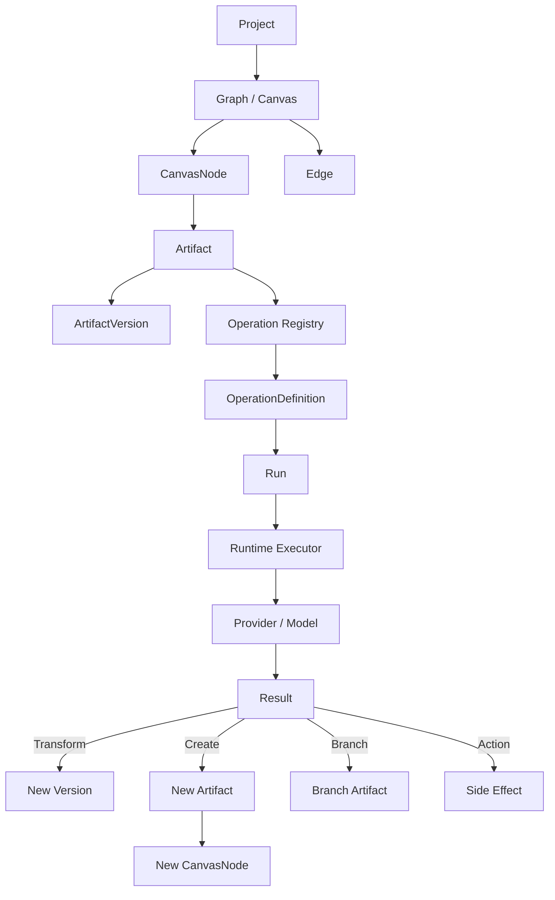

# 个人自媒体创作台
# PRD + Node Runtime SPEC v0.2

> 文档用途：作为产品、前端、后端、AI Runtime Agent 的统一实现依据。  
> 文档性质：MVP 可执行规格，不是概念稿。  
> 核心目标：先完成稳定、可扩展的「Project + Infinite Canvas + Node + Inspector + Operation Runtime」骨架，再持续增加每种 Node 的具体创作能力。

---

## 1. 产品概述

### 1.1 产品名称

暂定：**个人自媒体创作台 / 灵感工坊**

### 1.2 产品定位

一个面向个人内容创作者的 AI 原生创作工作台。

产品通过：

- 多项目工作区
- 无限画布式内容 Pipeline
- 节点化内容组织
- AI Operation 执行
- 版本与分支
- 个人风格 / Project Context
- 素材与结果沉淀
- 多平台发布

把创作者从「灵感 → 选题 → 调研 → 大纲 → 脚本 → 图片 → 配音 → 视频 → 发布」的完整过程组织在同一工作空间中。

### 1.3 核心产品原则

1. **Project 是创作任务的最高工作单元。**
2. **Canvas 是 Project 的创作空间。**
3. **Node 代表内容，不代表操作。**
4. **Operation 代表对内容执行的能力。**
5. **同一内容的修改产生 Version，而不是不断增加 Canvas Node。**
6. **只有产生新的语义内容时才创建新的 Artifact / Node。**
7. **Canvas 主要负责展示结果、关系、状态，不承担重编辑器。**
8. **复杂操作集中在 Inspector / Advanced Editor。**
9. **每个 Node 的未来操作必须通过 Registry 扩展，而不是写死在组件里。**
10. **从第一版开始考虑大画布性能、异步生成、并发和失败恢复。**

---

# 2. 产品目标

## 2.1 MVP 目标

MVP 必须完成以下闭环：

```text
创建 Project
    ↓
进入 Project Canvas
    ↓
创建 Topic
    ↓
点击 Topic
    ↓
Inspector 展示可执行 Operation
    ↓
执行 generate_outline
    ↓
创建 Run
    ↓
生成完成
    ↓
创建 Outline Artifact + Canvas Node + Edge
    ↓
继续 generate_script / generate_cover / generate_voice
```

至少跑通以下三条链路：

```text
Topic → Outline → Script
```

```text
Script → Cover / Image
```

```text
Script → Voice → Video
```

Publish 可以位于 MVP 后半阶段。

## 2.2 非 MVP 目标

第一阶段不要求：

- 完整自动化 DAG Scheduler
- 任意循环工作流
- 自动执行所有下游节点
- Canvas 内完整视频 Timeline
- Canvas 内完整富文本编辑器
- 专业 Photoshop 级图片编辑
- 多人实时协同
- 完整评论系统
- 完整数据分析系统
- 大规模团队权限系统

底层数据结构允许未来扩展，但 UI 不提前暴露复杂能力。

---

# 3. 用户核心任务

## 3.1 创建一个内容项目

用户可以：

- 新建 Project
- 设置项目名称
- 设置内容类型
- 设置目标平台
- 设置 Project Context
- 绑定 Personal Style
- 打开多个 Project Tab
- 在 Project 间快速切换

## 3.2 在 Canvas 中组织创作

用户可以：

- 创建 Node
- 拖动 Node
- 缩放 / 平移 Canvas
- 创建 Edge
- 删除 Edge
- 多选节点
- 复制 / 删除 / 分组节点
- 通过当前 Node 继续创作
- 查看运行状态
- 打开 Inspector
- 查看 Version
- 创建 Branch

## 3.3 使用 AI Operation 创作

用户可以从一个已有 Artifact 执行：

- Generate
- Transform
- Branch
- Action

未来不断增加更细粒度能力：

- polish
- rewrite
- shorten
- expand
- research
- variation
- inpaint
- outpaint
- upscale
- tts
- replace_segment
- caption
- publish
- ...

但这些都不得改变核心 Runtime 结构。

---

# 4. 信息架构

```text
Application
│
├── Top Project Tabs
│   ├── Project A
│   ├── Project B
│   ├── Project C
│   └── + New Project
│
├── Global Sidebar
│   ├── 项目
│   ├── 节点
│   ├── 灵感
│   ├── 素材
│   ├── 个人风格
│   ├── 模板
│   ├── 发布
│   └── 历史
│
├── Project Workspace
│   ├── Canvas
│   ├── MiniMap
│   ├── Canvas Toolbar
│   └── Inspector
│
└── Global Header Actions
    ├── Search
    ├── Notifications
    ├── Share
    ├── Publish
    ├── Saved State
    └── User
```

重要：

**分享 / 发布属于项目级或全局级操作，固定放在右上角 Header，不作为 Canvas 内悬浮主按钮。**

Publish 仍可作为 Action Artifact/Node 出现在 Pipeline 中，用来表达内容生命周期，但全局「发布入口」位于 Header。

---

# 5. Project 模型

```ts
interface Project {
  id: string
  title: string
  contentType?: string
  targetPlatforms?: string[]

  graphId: string

  contextId?: string
  personalStyleId?: string

  status: "active" | "archived"

  createdAt: string
  updatedAt: string
}
```

## 5.1 多 Project Tab

顶部允许打开多个 Project。

每个 Tab 可显示：

- Project 名称
- Dirty 状态
- 当前 Run 状态
- 未查看完成任务数量
- Close

示例：

```text
[ AI Agent 视频  ● ] ×
[ Claude Code 文章 ] ×
[ 播客选题  3 ] ×
[ + 新建项目 ]
```

### 约束

非活动 Project：

- 不保持完整 Canvas DOM Mount
- 保存 viewport
- 保存 selection
- 保存打开的 Inspector Node
- 保存 unsaved local state
- Run 在后台可继续执行

切回时恢复。

---

# 6. 核心领域模型

整个 Runtime 必须严格区分：

```text
CanvasNode
Artifact
ArtifactVersion
Edge
OperationDefinition
Run
```

---

# 7. CanvasNode

CanvasNode 是 UI 表现实体。

```ts
interface CanvasNode {
  id: string
  projectId: string
  artifactId: string

  x: number
  y: number

  width?: number
  height?: number

  collapsed?: boolean
  zIndex?: number

  renderer: string

  createdAt: string
  updatedAt: string
}
```

CanvasNode 不直接保存：

- 正文全文
- 高清图片
- Video Blob
- Audio Blob
- 全部 Versions
- 全部 Runs
- Prompt History
- Provider Response

CanvasNode 只保留：

- artifactId
- layout
- UI-specific state

---

# 8. Artifact

Artifact 是真实内容实体。

```ts
type ArtifactKind =
  | "text"
  | "image"
  | "audio"
  | "video"
  | "collection"
  | "action"

interface Artifact {
  id: string
  projectId: string

  kind: ArtifactKind
  role: string

  currentVersionId?: string

  createdAt: string
  updatedAt: string
}
```

## 8.1 kind / role 设计

不要为每一种业务内容创建独立底层类型。

例如：

```ts
{
  kind: "text",
  role: "topic"
}
```

```ts
{
  kind: "text",
  role: "outline"
}
```

```ts
{
  kind: "text",
  role: "script"
}
```

```ts
{
  kind: "image",
  role: "cover"
}
```

```ts
{
  kind: "image",
  role: "illustration"
}
```

这样可以共享 Renderer 和 Capability。

---

# 9. ArtifactVersion

```ts
interface ArtifactVersion {
  id: string
  artifactId: string
  parentVersionId?: string

  contentRef: string
  metadata?: Record<string, unknown>

  source: "ai" | "user" | "import" | "system"

  operationRunId?: string

  createdBy?: string
  createdAt: string
}
```

## 9.1 Version 规则

以下行为默认产生新 Version，不创建新 Node：

- polish
- rewrite
- expand
- shorten
- manual_edit
- upscale
- inpaint
- outpaint
- replace_segment（如果语义仍是同一视频）
- adjust_voice
- change_caption_style

用户可以从历史 Version 恢复。

恢复历史版本时：

- 不删除新版本
- 创建一个新的 current Version 引用，或创建 restore Version
- 必须保留历史链

---

# 10. Edge

```ts
interface Edge {
  id: string
  projectId: string

  sourceArtifactId: string
  targetArtifactId: string

  inputSlot: string

  createdAt: string
}
```

Edge 不是纯视觉线。

必须表达输入语义。

例如：

```text
Topic ── topic ──→ Outline
Outline ── outline ──→ Script
Script ── script ──→ Voice
Voice ── voice ──→ Video
Image ── visual ──→ Video
```

---

# 11. Operation Runtime

## 11.1 四种基础行为

所有 Operation 在产品交互层归类为：

```ts
type OperationBehavior =
  | "create"
  | "transform"
  | "branch"
  | "action"
```

### CREATE

从当前 Artifact 产生新的语义 Artifact。

```text
Topic
 ↓ generate_outline
Outline
```

### TRANSFORM

修改同一 Artifact，产生新 Version。

```text
Outline v1
 ↓ polish
Outline v2
```

Canvas 仍为一个 Outline Node。

### BRANCH

基于当前内容明确创建新的并行方向。

```text
          Cover A
Script ──┤
          Cover B
```

### ACTION

执行副作用，不一定生成内容。

```text
Video
 ↓ publish
Platform
```

---

# 12. OperationDefinition

每一个未来新增能力都必须通过 Registry 注册。

```ts
type OperationOutputBehavior =
  | "new_artifact"
  | "new_version"
  | "new_collection"
  | "side_effect"

interface OperationDefinition {
  id: string
  label: string
  description?: string

  behavior:
    | "create"
    | "transform"
    | "branch"
    | "action"

  input: {
    kinds?: ArtifactKind[]
    roles?: string[]
    slots?: InputSlotDefinition[]
  }

  output?: {
    kind?: ArtifactKind
    role?: string
    behavior: OperationOutputBehavior
  }

  configSchema?: unknown
  defaultConfig?: Record<string, unknown>

  executor: string

  presentation: {
    group:
      | "continue"
      | "optimize"
      | "branch"
      | "media"
      | "publish"
      | "advanced"
      | "more"

    priority: number

    icon?: string

    placement:
      | "primary"
      | "secondary"
      | "more"

    danger?: boolean
  }

  runtime?: {
    streaming?: boolean
    cancellable?: boolean
    retryable?: boolean
    expectedDuration?: "instant" | "short" | "medium" | "long"
  }

  featureFlag?: string
}
```

---

# 13. 为什么要 Operation Registry

禁止：

```ts
if (node.role === "cover") {
  showInpaint()
  showUpscale()
}
```

禁止：

```ts
switch(node.type) {
  ...
}
```

推荐：

```ts
const operations =
  operationRegistry.getAvailableOperations({
    artifact,
    projectContext,
    permissions,
    featureFlags
  })
```

Inspector 根据 Registry 自动生成操作。

后续新增：

```text
remove_background
character_consistency
generate_broll
lip_sync
auto_caption
translate_voice
```

不需要重构 Node Renderer。

---

# 14. Capability 计算

Capability 由以下条件共同决定：

```text
Artifact.kind
Artifact.role
Current Version metadata
Connected Inputs
Project Context
User Plan / Permission
Provider Availability
Feature Flag
Runtime State
```

例如：

```text
Cover Image
```

可能拥有：

```text
generate_variation
inpaint
outpaint
upscale
edit_title
generate_video
```

但普通 Reference Image 不一定拥有 `edit_title`。

---

# 15. Run

```ts
type RunStatus =
  | "queued"
  | "running"
  | "waiting_input"
  | "completed"
  | "failed"
  | "cancelled"

interface Run {
  id: string
  projectId: string

  operationId: string

  sourceArtifactId?: string

  inputVersionIds: string[]
  outputVersionIds?: string[]
  outputArtifactIds?: string[]

  status: RunStatus
  progress?: number

  config: Record<string, unknown>

  provider?: string
  model?: string

  errorCode?: string
  errorMessage?: string

  createdAt: string
  startedAt?: string
  completedAt?: string
}
```

---

# 16. Run 生命周期

```text
queued
  ↓
running
  ├── waiting_input
  ├── completed
  ├── failed
  └── cancelled
```

UI 统一为：

```text
待配置
排队中
生成中
等待输入
已完成
失败
已取消
```

---

# 17. Async Run 规则

### 创建 Operation

1. UI 读取 OperationDefinition
2. 解析输入
3. 验证 required input
4. 打开必要配置表单
5. 创建 Run
6. Runtime 执行
7. UI 显示生成状态
8. Runtime 返回 Result
9. 创建 Artifact / Version
10. 更新 Canvas

### 幂等性

每个 Run 必须拥有唯一 idempotency key。

重复请求不得重复创建结果。

### Cancel

Operation 标记 cancellable 时允许 Cancel。

Cancel 后：

- Run = cancelled
- 临时结果不设为 currentVersion
- 已完成的 Provider 资源可保留为 orphan Result，后台清理

### Retry

Retry 默认创建新 Run：

```text
Run #1 failed
 ↓ retry
Run #2 running
```

不得修改原 Run。

---

# 18. Input Resolution

Operation 不应该依赖 UI 组件手动拼 Prompt。

Runtime 统一解析输入。

例如：

```text
generate_script
```

需要：

```text
Topic
Outline
Research
Project Context
Personal Style
References
```

Runtime：

```ts
interface ResolvedInput {
  slot: string
  artifactId?: string
  versionId?: string
  value: unknown
}
```

---

# 19. Context Assembly

AI Context 建议分层：

```text
System Capability Context
+
Personal Style
+
Project Context
+
Connected Artifact Inputs
+
Reference Assets
+
Operation Config
+
User Temporary Instruction
```

不要让每个 Node 自己重新实现 Prompt 拼装。

---

# 20. Node Family

MVP Renderer 只实现：

```text
TextNode
ImageNode
AudioNode
VideoNode
CollectionNode
ActionNode
```

业务角色通过 role 控制。

---

# 21. TextNode

支持：

- Topic
- Research
- Outline
- Script
- Article
- Title
- Description

Node Preview：

- role icon
- title
- 2~6 行 preview
- metadata
- status
- version
- avatar / source 可选

Canvas 不挂载富文本 Editor。

---

# 22. ImageNode

支持：

- Cover
- Illustration
- Thumbnail
- Reference

Canvas：

- thumbnail
- ratio
- selected state
- result state

不加载原图。

Preview 使用压缩 WebP/AVIF。

---

# 23. AudioNode

Canvas：

- waveform preview
- duration
- voice name
- status

不挂载完整 Waveform Editor。

只有用户播放时 Lazy Mount audio。

---

# 24. VideoNode

Canvas：

- poster image
- duration
- resolution
- status

不要持续 Mount `<video>`。

点击播放后 Lazy Mount Player。

---

# 25. CollectionNode

Collection 是 AI 多候选结果的一等公民。

例如：

- Cover variants
- Title variants
- Hook variants
- B-roll variants
- Voice variants
- Video variants

```ts
interface CollectionData {
  candidateArtifactIds: string[]
  selectedArtifactId?: string
}
```

Collection 必须支持：

- Select
- Compare
- Regenerate
- Generate More
- Promote to Node
- Delete Candidate

---

# 26. ActionNode

用于表达：

- Publish
- Export
- Send to Lark
- Save to Obsidian
- Upload to Platform

ActionNode 主要表现外部副作用和状态。

---

# 27. MVP Artifact Roles

```text
text/topic
text/outline
text/script

image/cover
image/illustration

audio/voice

video/draft

action/publish
```

---

# 28. MVP Operation Matrix

## Topic

可执行：

```text
edit
generate_outline
generate_script
research
generate_cover
branch
```

## Outline

可执行：

```text
edit
polish
rewrite
expand
shorten
generate_script
generate_article
branch
```

## Script

可执行：

```text
edit
polish
rewrite
shorten
expand
generate_cover
generate_images
generate_voice
generate_video
branch
```

## Cover

可执行：

```text
edit_prompt
generate_variants
inpaint
outpaint
upscale
edit_title
change_ratio
generate_video
branch
```

## Illustration

```text
edit_prompt
generate_variants
inpaint
outpaint
upscale
replace
match_style
```

## Voice

```text
regenerate
change_voice
change_speed
change_emotion
normalize
generate_video
```

## Video

```text
regenerate
replace_segment
extend
add_caption
replace_broll
change_music
open_editor
publish
```

## Publish

```text
preview
publish
schedule
republish
export
```

---

# 29. Node 与 Version / Branch 规则

## 新 Node

不同内容阶段：

```text
Topic → Outline
Outline → Script
Script → Cover
Script → Voice
Voice → Video
```

## 新 Version

同一内容优化：

```text
Outline v1
 ↓ polish
Outline v2
```

## Branch

明确保留不同方向：

```text
             Script A
Outline ─────┤
             Script B
```

## Collection

一次生成多个候选：

```text
Script
 ↓ generate_cover_variants
Cover Collection
 ├ A
 ├ B
 ├ C ✓
 └ D
```

---

# 30. Canvas 交互

## 30.1 创建 Node

入口一：Canvas 空白处

```text
Double Click / +
 ↓
Node Picker
 ↓
创建 Node
```

入口二：从当前 Node 继续创作

```text
Select Node
 ↓
Inspector
 ↓
Continue Creation
 ↓
Operation
 ↓
Result Node
```

入口三：Handle Drag

```text
Node Handle
 ↓
Drag to Empty
 ↓
Quick Insert
 ↓
Select compatible Node / Operation
```

第三种可以在 MVP 第二阶段实现。

---

# 31. 选中 Node

单击：

- selectedNodeId 更新
- Node 显示 selected border
- Inspector 打开
- Inspector 加载 Artifact Summary
- Inspector Lazy Load Versions
- Inspector Lazy Load Operations

双击：

- Text → Advanced Text Editor
- Image → Image Editor / Detail
- Audio → Audio Detail
- Video → Video Preview / Editor

---

# 32. Node Hover

Hover 最多显示：

```text
Primary Action
More
Connection Handle
```

禁止在 Node 上堆满操作按钮。

---

# 33. Inspector

Inspector 是核心 Operation Surface。

固定布局：

```text
Header
Tabs
Input Context
Artifact Preview
Config
Primary Actions
Secondary Actions
Results
Version
```

详情见 UI Interaction SPEC。

---

# 34. Performance Architecture

Canvas 性能不采用传统 Virtual List 为核心。

使用：

```text
Viewport Culling
+
LOD
+
Lazy Media
+
State Isolation
+
Memoized Node Renderer
+
Incremental Data Fetch
```

Virtual List 用于：

- Assets
- Version History
- Run History
- Search
- Template List
- Node List

---

# 35. Viewport Culling

视口外：

- 不 Mount 重组件
- 不加载原始媒体
- 不加载 Editor
- 不加载结果详情
- Node 可退化为轻量 placeholder

---

# 36. LOD

## zoom < 0.35

只显示：

```text
icon + title + status
```

## 0.35 <= zoom < 0.7

显示：

```text
title + basic preview + status
```

## zoom >= 0.7

显示：

```text
full node card
```

LOD 切换必须避免 layout jump。

Node 基础宽高在不同 LOD 下保持视觉中心一致。

---

# 37. Store Isolation

至少拆分：

```text
CanvasStore
ArtifactStore
RunStore
UIStore
```

## CanvasStore

- viewport
- positions
- selection
- hover
- dragging
- edge editing

## ArtifactStore

- summaries
- current versions
- metadata

## RunStore

- active runs
- progress
- failures
- queue

## UIStore

- inspector
- modal
- editor
- context menu

禁止：

```text
node.data.everything
```

---

# 38. React 更新规则

Node Renderer 只订阅：

```text
node layout
artifact summary
active run summary
selection state
```

不要订阅整个 nodes 数组。

Run Streaming：

Inspector 可以实时流式显示。

Canvas 更新节流：

- 文本生成不按 token 更新 Node
- 500ms~2000ms 节流更新状态
- 完成后一次刷新 Preview

---

# 39. 媒体策略

## Image

Canvas 加载：

- 低分辨率 thumbnail
- lazy decode

## Audio

Canvas：

- waveform preview data
- 点击播放才 load audio

## Video

Canvas：

- poster
- duration
- 点击才 mount player

---

# 40. 缓存与请求

推荐：

```text
Project Graph Cache
Artifact Summary Cache
Version Detail Cache
Operation Registry Cache
Run State Realtime Cache
Thumbnail Cache
```

切 Project 时：

- graph 可缓存
- detail 按需
- media lazy

---

# 41. 实时事件

Runtime 事件：

```text
run.created
run.started
run.progress
run.completed
run.failed
run.cancelled

artifact.created
artifact.version.created
artifact.updated

node.created
node.updated
node.deleted

edge.created
edge.deleted
```

UI 通过事件更新，而不是不断轮询完整 Project。

---

# 42. API 概念接口

```text
GET    /projects/:id
GET    /projects/:id/graph

POST   /projects/:id/nodes
PATCH  /nodes/:id
DELETE /nodes/:id

POST   /edges
DELETE /edges/:id

GET    /artifacts/:id
GET    /artifacts/:id/versions

GET    /artifacts/:id/operations

POST   /operations/:operationId/runs
GET    /runs/:id
POST   /runs/:id/cancel
POST   /runs/:id/retry
```

---

# 43. 创建 Operation 的请求

```json
{
  "projectId": "p_1",
  "sourceArtifactId": "artifact_topic_1",
  "operationId": "generate_outline",
  "inputVersionIds": ["version_topic_3"],
  "config": {
    "length": "medium",
    "style": "structured"
  },
  "idempotencyKey": "..."
}
```

---

# 44. Operation 返回

异步：

```json
{
  "runId": "run_1",
  "status": "queued"
}
```

完成后 Event：

```json
{
  "type": "run.completed",
  "runId": "run_1",
  "outputArtifactIds": ["artifact_outline_1"],
  "outputVersionIds": ["version_outline_1"]
}
```

前端根据 outputBehavior 决定：

- update same Node
- create Node
- create Collection
- show side-effect result

---

# 45. 自动布局

新 Node 生成时：

默认位置：

```text
sourceNode.right + horizontalGap
```

如果有多个输出：

垂直分布。

不要每次创建都重新布局整个 Canvas。

提供用户按钮：

```text
自动整理
```

用户主动执行时再运行全局布局。

---

# 46. Undo / Redo

Canvas UI 操作：

- move
- resize
- edge create/delete
- node delete
- group

支持 Undo/Redo。

AI Operation：

默认不通过传统 Undo 删除历史。

Artifact 内容恢复通过 Version History。

---

# 47. 删除语义

删除 Canvas Node 默认：

```text
remove CanvasNode
```

Artifact 不立即物理删除。

如果 Artifact 无任何引用：

标记 orphan。

垃圾回收延迟执行。

用户明确选择：

```text
同时删除内容
```

才进入 Artifact soft delete。

---

# 48. 错误处理

Run failed Node：

```text
失败
[重试]
[修改参数]
```

Inspector 显示：

- human readable message
- provider message（折叠）
- retry
- change model
- cancel

禁止直接把原始异常堆栈展示给普通用户。

---

# 49. Loading

Graph 初次加载：

- Skeleton Node
- Progressive render

Inspector：

- Header 先展示
- Versions Lazy
- Related Results Lazy

Media：

- thumbnail placeholder

---

# 50. 空状态

Canvas Empty：

中心显示：

```text
开始你的第一个创作节点

[创建选题]
[输入文字]
[上传素材]
```

底部提示：

```text
双击画布也可以创建节点
```

---

# 51. Design Tokens

方向：

**Dark / Low Saturation / Creator Tool**

建议语义 Token：

```text
bg.app
bg.sidebar
bg.canvas
bg.panel
bg.node
bg.node.hover

border.default
border.selected

text.primary
text.secondary
text.tertiary

accent.primary
accent.ai

status.success
status.running
status.warning
status.error

node.text
node.image
node.audio
node.video
node.action
```

Node 不允许整卡高饱和填色。

颜色只用于：

- icon
- thin border
- tiny badge
- active glow

---

# 52. Accessibility

最低要求：

- Text / Background 对比可读
- Selected 不只依赖颜色
- Status 有 icon + text
- Keyboard focus 可见
- Toolbar 有 tooltip
- Icon button 有 aria-label

---

# 53. Keyboard Interaction

建议：

```text
Space + Drag   Pan
Wheel          Zoom / Scroll according to platform
Cmd/Ctrl + Z   Undo
Cmd/Ctrl + Shift + Z Redo
Delete         Delete selected
Cmd/Ctrl + C   Copy
Cmd/Ctrl + V   Paste
Cmd/Ctrl + D   Duplicate
F              Focus selected
Esc            Clear selection / close menu
Enter          Open selected node
```

---

# 54. Telemetry

至少记录：

```text
project_created
node_created
node_selected
operation_opened
operation_started
operation_completed
operation_failed
version_restored
branch_created
project_switched
canvas_performance_sample
```

---

# 55. 性能预算

MVP 目标：

### 100 Nodes

- 首屏可交互 < 1.5s（本地缓存命中目标）
- Pan / Zoom 视觉流畅

### 300 Nodes

- 普通操作保持流畅
- Node Drag 不触发全图重渲染

### 500 Nodes

- 开启 culling / LOD 后仍可用

### 1000 Nodes

不作为 MVP 的强 SLA，但架构不得因全部重组件 Mount 而直接不可用。

必须建立：

```text
100 / 300 / 500 / 1000 Nodes Benchmark
```

---

# 56. Agent 实现边界

开发 Agent 必须遵守：

## MUST

1. 使用统一 Artifact / Version / Operation / Run 模型。
2. Node Renderer 只按 Family 实现。
3. Operation 通过 Registry 注册。
4. Inspector 操作由 Registry 驱动。
5. CREATE / TRANSFORM / BRANCH / ACTION 的结果行为必须统一处理。
6. Canvas layout state 与 artifact content state 分离。
7. Media 必须 Lazy Load。
8. 多 Project 不同时 Mount 多个重 Canvas。
9. AI Run 不按 token 高频刷新 Canvas。
10. 所有主要状态必须有 loading / empty / error。

## MUST NOT

1. 不允许为每一个 Operation 新建一种 Canvas Node 类型。
2. 不允许把全部操作写死进具体 Node Component。
3. 不允许把正文/高清媒体直接放在 Canvas Store。
4. 不允许通过删除 Version 实现恢复。
5. 不允许 Run Retry 覆盖旧 Run。
6. 不允许 Canvas Node 永久 Mount Video / Rich Editor。
7. 不允许项目 Tab 切换后保留所有 Canvas DOM。

---

# 57. 建议前端模块边界

```text
src/
├── app/
├── projects/
├── canvas/
│   ├── shell/
│   ├── nodes/
│   ├── edges/
│   ├── toolbar/
│   ├── minimap/
│   ├── interactions/
│   └── store/
│
├── artifacts/
│   ├── domain/
│   ├── api/
│   └── cache/
│
├── operations/
│   ├── registry/
│   ├── schemas/
│   └── ui/
│
├── runtime/
│   ├── runs/
│   ├── events/
│   └── provider/
│
├── inspector/
│   ├── shell/
│   ├── sections/
│   ├── fields/
│   └── result-renderers/
│
├── editors/
│   ├── text/
│   ├── image/
│   ├── audio/
│   └── video/
│
└── shared/
```

---

# 58. Agent 执行阶段

## Phase 0 — Foundation

交付：

- Dark Design Tokens
- App Shell
- Project Tabs
- Sidebar
- Inspector Shell
- Empty Canvas

验收：

- UI 结构与设计稿一致
- Project Tab 可切换
- Inspector 可开关

---

## Phase 1 — Graph Runtime Skeleton

交付：

- Canvas
- Node rendering
- Edge
- Pan/Zoom
- Selection
- Drag
- MiniMap
- Canvas Toolbar

Node Family：

- Text
- Image
- Audio
- Video
- Collection
- Action

验收：

- 可创建、移动、选中、删除 Node
- Edge 正常
- 100 Nodes 可流畅操作

---

## Phase 2 — Artifact Runtime

交付：

- Artifact
- Version
- Operation Registry
- Run Store
- Inspector Operation Renderer

验收：

- Operation 自动按 Node 生成
- Transform 创建 Version
- Create 创建 Artifact + Node

---

## Phase 3 — First Real Pipeline

实现：

```text
Topic
 ↓ generate_outline
Outline
 ↓ generate_script
Script
```

验收：

- Run loading
- complete
- failed
- retry
- version

全部跑通。

---

## Phase 4 — Media

实现：

```text
Script → Cover
Script → Voice
Voice → Video
```

验收：

- Image Collection
- Audio Lazy
- Video Lazy
- Result selected

---

## Phase 5 — Performance

实现：

- viewport culling
- LOD
- cache
- project unmount
- optimized subscriptions

跑：

```text
100 / 300 / 500 / 1000 node benchmarks
```

---

# 59. MVP Definition of Done

项目只有满足以下条件才算 Node Runtime MVP 完成：

- [ ] 可创建 Project
- [ ] 多 Project Tab 正常
- [ ] 可创建 Node
- [ ] 可拖动 Node
- [ ] 可连接 Edge
- [ ] 点击 Node 打开 Inspector
- [ ] Inspector 自动展示 Registry Operation
- [ ] CREATE 可创建下游 Artifact + Node
- [ ] TRANSFORM 可创建 Version
- [ ] BRANCH 可创建并行 Node
- [ ] ACTION 可执行副作用 Run
- [ ] Run 支持 queued/running/completed/failed/cancelled
- [ ] Retry 创建新 Run
- [ ] Version History 可查看与恢复
- [ ] Text/Image/Audio/Video 基础 Renderer 可用
- [ ] Image 多候选 Collection 可选择
- [ ] Inspector 支持 loading/error
- [ ] Canvas 不直接加载完整重媒体
- [ ] Project 切换不会保留多个重 Canvas
- [ ] 300 Nodes 基础操作稳定
- [ ] 关键交互符合 UI SPEC

---

# 60. 后续扩展协议

未来增加一个新 Operation，例如：

```text
remove_background
```

开发者只应需要：

1. 注册 OperationDefinition
2. 定义 Config Schema
3. 实现 Executor
4. 实现可选 Result Renderer
5. 添加权限/Feature Flag
6. 添加测试

**不应该修改 Base ImageNode。**

未来增加一个新角色，例如：

```text
image/product_shot
```

优先复用 ImageNode。

只有展示结构确实不兼容时才新增 Renderer。

---

# 61. 最终架构图



---

# 62. 一句话实现约束

> **Node 是内容容器，Operation 是可插拔能力，Version 管修改，Branch 管方向，Run 管执行，Canvas 只管理视觉关系。**

任何实现方案只要破坏这条原则，都需要重新评审。
